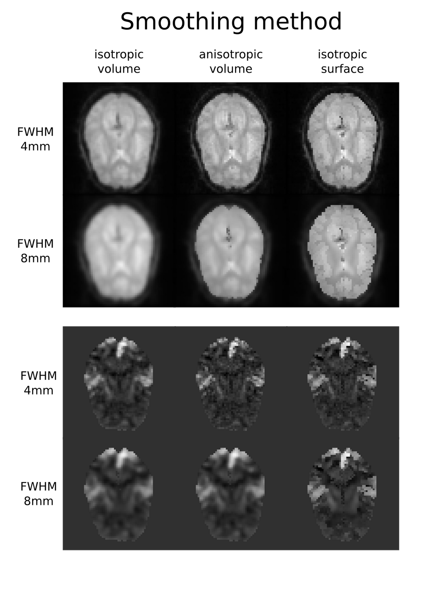

NiPyPe: Towards extensible, flexible and lightweight neuroimaging data
processing framework
===========================================================================================

Abstract
--------

Introduction
------------

Over the past twenty years, advances in non-invasive in vivo
neuroimaging have resulted in an explosion of studies investigating
human cognition in health and disease. Current imaging studies acquire
multi-modal image data (e.g., structural, diffusion, functional) and
combine with non-imaging behavioural data, patient and/or treatment
history and demographic and genetic information. Several sophisticated
software packages (e.g., AFNI, BrainVoyager, FSL, FreeSurfer, NiPy, R,
SPM) are used to process and analyze such extensive data. In a typical
analysis, algorithms from these packages, each with its own set of
parameters, process the raw data. However, data collected for a single
study can be diverse (highly multi-dimensional) and large, and
algorithms suited for one dataset may not be optimal for another. This
complicates analysis methods and makes data exploration and inference
challenging and comparative analysis of new algorithms difficult.

Current problems
~~~~~~~~~~~~~~~~

Several technical, practical and social issues hinder replicable,
efficient and optimal use of neuroimaging analysis approaches.

No uniform access to neuroimaging analysis software and usage
information.

For current multimodal datasets, researchers typically resort to using
different software packages for different components of the analysis.
However, these different software packages use different languages and
environments for development, such as: C/C++ (FSL), MATLAB (SPM), Java
(Camino), Python (NiPy). This has resulted in a heterogeneous set of
software with no uniform way to use these tools or execute them. With
the primary focus on algorithmic improvement, academic software
development often lacks a rigorous software engineering framework that
involves extensive testing and documentation and ensures compatibility
with other tools. This often necessitates extensive interactions with
the authors of the software to understand their parameters, their quirks
and their usage.

No framework for comparative algorithm development and dissemination.
Except for some large software development efforts (e.g., SPM, FSL,
FreeSurfer), most algorithm development happens in-house and stays
within the walls of a lab, without extensive exposure or testing.
Furthermore, testing comparative efficacy of algorithms often requires
significant effort (Klein et al., 2010). In general, developers create
software for a single package (e.g., VBM8 for SPM), create a standalone
cross platform tool (e.g., mricron) or simply do not distribute the
software (e.g., normalization software used for the architectonic
atlases - CHECK).

Personnel turnover in laboratories often limit methodological continuity
and training new personnel takes time.

In most cognitive neuroscience laboratories, the aims are to understand
some aspect of cognition. Although, a majority of such laboratories
gather and analyze neuroimaging data, very few of them have the
personnel with the technical expertise to understand methodological
development and modify laboratory procedures to adopt new tools.
Typically, processing steps are created and crystallized till a lab
member with appropriate skills can modify the procedures. Typical
training takes place through self-teaching by following online tutorials
or taking organized courses or most often by learning from existing
members of the lab. While this provides some amount of continuity,
understanding different aspects of neuroimaging is a steep learning
curve. This is even greater in the context of all the different
algorithms and software packages available for analysis.

Neuroimaging software packages do not address computational efficiency.

The primary focus of neuroimaging analysis algorithms is to solve
problems (e.g., registration, statistical estimation, tractography).
While some developers focus on algorithmic or numerical efficiency, most
developers do not focus on efficiency in the context of running multiple
algorithms on multiple subjects, a common scenario in neuroimaging
analysis. Creating an analysis workflow for a particular study is an
iterative process dependent on the quality of the data and participant
population (e.g., neurotypical, presurgical, etc). Researchers usually
experiment with different methods and their parameters to create a
workflow suitable for their application. A computationally efficient
execution allows for multiple rapid-iterations to optimize this tuning
process. Support for optimized local execution (running independent
processes in parallel, rerunning only those steps that have been
influenced by the changes in parameters or dependencies since the last
run) and exploration of parameter space could ease this prototyping
stage of workflow development. Furthermore, very few of the available
neuroimaging tools take advantage of the growing number of parallel
hardware configurations (multicore, clusters, clouds and
supercomputers).

Methods sections in published articles are inadequate for reproducing
results.

A typical neuroimaging analysis process involves several different
algorithms with different parameter choices. However, very few
publications contain necessary information (e.g., data, scripts,
computer code) to reproduce results (however, see current manuscript
submission policies for Science and PNAS). Accurately reproducing the
results of a study without such details is almost impossible.
Furthermore, with a lack of standards for review, there is significant
variability in the review process for screening of the appropriateness
of algorithms used for various processing steps. For example, it is
still common to see the use of SPM’s normalization even though the
authors themselves point to more accurate options for normalization.

In-depth knowledge of neuroimaging analysis algorithms is limited to few
individuals.

While several analysis packages implement all “procedures” necessary to
perform a particular analyses (e.g., doing a group fMRI study), the
details of the implementation are, however, different. For example, SPM
uses isotropic smoothing and FSL performs anisotropic smoothing based on
the distribution of local voxel intensities. While a potential user (a
cognitive neuroscientist) would like to freely combine processing steps
from different packages to obtain an optimal workflow, such operational
details are often not available within a laboratory knowledgebase. Thus,
the diversity of software solutions in neuroimaging field results in a
steep learning curve and high training costs.

Current solutions
~~~~~~~~~~~~~~~~~

One attempt to address some of these issues has resulted in the SPM
batch execution system. Unfortunately it supports only SPM modules and
does not run in parallel. A much more extensible and feature rich
solution is the LONI Pipeline (I. D. Dinov et al., 2009; I. Dinov et
al., 2010; Rex, Ma, & A. W. Toga, 2003). It provides an easy to use
graphical interface for choosing processing steps or nodes from a
predefined library and defining their dependencies and parameters. It
also has extensive support for parallel execution on an appropriately
configured cluster (including data transfer, pausing execution, and
combining local and remote software). Additionally, the LONI Pipeline
saves information about executed steps (such as software origin, version
and architecture) providing provenance information (A. J.
Mackenzie-Graham, J. D. Van Horn, R. P. Woods, Crawford, & A. W. Toga,
2008).

Processing nodes are defined in the LONI Pipeline using eXtensible
Markup Language (XML). This one “size fits all” method makes it easy to
add new nodes as long as they are well behaved command lines. However,
many software packages do not meet this criterion. For example, SPM,
written in MATLAB, does not provide a command line interface.
Furthermore, for several command line programs arguments are not easy to
describe in the LONI XML schema (e.g., ANTS – Avants & Gee, 2004).
Although it provides a wonderful graphical interface, the LONI Pipeline
environment does not provide an easy option to script a workflow or for
rapidly exploring parametric variations within a workflow (e.g.,
VisTrails\ :sup:``[1] <#ftnt1>`_`\ ). Finally, due to restrictive
licensing it is not straightforward to modify and redistribute the
modifications.

To address issues with existing workflow systems and the ones described
earlier, we present NiPyPE (Neuroimaging in Python: Pipelines and
Interfaces), an open source, community-developed, Python-based software
package that easily interfaces with existing software for efficient
analysis of neuroimaging data and rapid comparative development of
algorithms. NiPyPE uses a flexible, efficient and well designed
programming language – Python – as its foundation. Processing modules
and their inputs and outputs are described in an object-oriented manner
providing the flexibility to interface with any type of software (not
just well behaved command lines). The workflow execution engine has a
plug-in architecture and supports both local execution on multicore
machines and remote execution on clusters. NiPyPE is distributed with a
BSD License allowing anyone to make changes and redistribute it.
Development is done openly with collaborators from many different labs,
allowing rapid adaptation to the varied needs of the neuroimaging
community.

Methods
-------

NiPyPE consists of three components (see Figure architecture\_overview):
1) interfaces or wrappers around external tools that provide unified way
for setting inputs, executing and retrieving outputs; 2) a workflow
engine that allows creating analysis pipelines by connecting inputs and
outputs of interfaces as a directed acyclic graph (DAG); and 3) plugins
that execute workflows either locally or in a distributed processing
environment (e.g., Torque\ :sup:``[2] <#ftnt2>`_`\ , SGE/OGE). In the
following sections, we describe key architectural components and
features of this software.

|image0|Figure architecture\_overview. Architecture overview of the
NiPyPe framework. Interfaces are wrapped with Nodes or MapNodes and
connected together within a Workflows. Workflows themselves can act as a
Node inside another Workflows supporting encapsulation desing pattern.
Dependency graph is transformed before executing by the engine
component. Execution is performed by one of the plugins. Currently
NiPyPe supports serial and parallel (both local multithreading and
cluster) execution.

Interfaces
~~~~~~~~~~

Interfaces form the core of NiPyPE. As stated earlier, the goal of
“Interfaces” is to provide a uniform mechanism for accessing analysis
tools from neuroimaging software packages (e.g., FreeSurfer, FSL, SPM).
For example, there is a Realign Interface that exposes the SPM
realignment routine, while the MCFLIRT Interface exposes the FSL
realignment routine. In addition, one can also implement an algorithm in
Python within NiPyPE and expose it as an Interface. Interfaces are
flexible and can accommodate the heterogeneous software that needs to be
supported, while providing unified and uniform access to these tools for
the user. Since, there is no need for the underlying software to be
changed (recompiled or adjusted to conform with a certain standard),
developers can continue to create software using the computer language
of their choice.

An Interface definition consists of: (a) input parameters, their types
(e.g., file, floating point value, list of integers, etc.,.) and
dependencies (e.g., does input ‘a’ require input ‘b’); (b) outputs and
their types, (c) how to execute the underlying software (e.g., execute a
matlab script, or call a command line program); and (d) a mapping which
defines the outputs that are produced given a particular set of inputs.
Using an object oriented approach, we minimize redundancy in interface
definition by creating a hierarchy of base Interface classes (see Figure
simplified\_hierarchy) to encapsulate common functionality (e.g.
Interfaces that call command line programs are derived from the
CommandLine class, which provides methods to translate Interface inputs
into command line parameters and for calling the command).

from nipype.interfaces.base import (
 TraitedSpec,
 CommandLineInputSpec,
 CommandLine,
 File
)
import os
class GZipInputSpec(CommandLineInputSpec):
 input\_file = File(desc = "File", exists = True, mandatory = True,
argstr="%s")
class GZipOutputSpec(TraitedSpec):
 output\_file = File(desc = "Zip file", exists = True)
class GZipTask(CommandLine):
 input\_spec = GZipInputSpec
 output\_spec = GZipOutputSpec
 cmd = 'gzip'
 def \_list\_outputs(self):
 outputs = self.output\_spec().get()
 outputs['output\_file'] = os.path.abspath(self.inputs.input\_file +
".gz")
 return outputs
if \_\_name\_\_ == '\_\_main\_\_':
 zipper = GZipTask(input\_file='an\_existing\_file')
 print zipper.cmdline
 zipper.run()

|image1|Figure simplified\_class\_hierarchy. Simplified class hierarchy
of Interfaces. Our framework tries to reduce code redundancy and thus
make adding new interfaces easier and quicker. For example all
functionality related to execution of command line applications is
grouped in one class. New classes can be added on top of that. For
example FSL Interfaces are essentially command lines with some extra
common properties (such as setting the type of the output file by an
environment variable).

We use Enthought Traits\ :sup:``[3] <#ftnt3>`_`\  to create a formal
definition for Interface inputs and outputs, to define input constraints
(e.g., type, dependency, whether mandatory) and to provide validation
(e.g., file existence). This allows malformed or underspecified inputs
to be detected prior to executing the underlying program. The input
definition also allows specifying relations between inputs. Often, some
input options should not be set together (mutual exclusion) while other
inputs need to be set as a group (mutual inclusion). An example input
specification for the ‘bet’ program from FSL is shown in Figure below.

class BETInputSpec(FSLCommandInputSpec):\ :sup:``[a] <#cmnt1>`_`\ 

""""""

# We use position args here as list indices - so a negative number

# will put something on the end

in\_file = File(exists=True,

desc = 'input file to skull strip',

argstr='%s', position=0, mandatory=True)

out\_file = File(desc = 'name of output skull stripped image',

argstr='%s', position=1, genfile=True)

outline = traits.Bool(desc = 'create surface outline image',

argstr='-o')

mask = traits.Bool(desc = 'create binary mask image',

argstr='-m')

skull = traits.Bool(desc = 'create skull image',

argstr='-s')

no\_output = traits.Bool(argstr='-n',

desc="Don't generate segmented output")

frac = traits.Float(desc = 'fractional intensity threshold',

argstr='-f %.2f')

vertical\_gradient = traits.Float(argstr='-g %.2f',

desc='vertical gradient in fractional intensity ' \\

'threshold (-1, 1)')

radius = traits.Int(argstr='-r %d', units='mm',

desc="head radius")

center = traits.List(traits.Int, desc = 'center of gravity in voxels',

argstr='-c %s', minlen=0, maxlen=3,

units='voxels')

threshold = traits.Bool(argstr='-t',

desc="apply thresholding to segmented brain image and mask")

mesh = traits.Bool(argstr='-e',

desc="generate a vtk mesh brain surface")

# the remaining 'options' are more like modes (mutually exclusive) that

# FSL actually implements in a shell script wrapper around the bet
binary.

# for some combinations of them in specific order a call would not fail,

# but in general using more than one of the following is clearly not

# supported

\_xor\_inputs = ('functional', 'reduce\_bias', 'robust', 'padding',

'remove\_eyes', 'surfaces', 't2\_guided')

robust = traits.Bool(desc='robust brain centre estimation ' \\

'(iterates BET several times)',

argstr='-R', xor=\_xor\_inputs)

padding = traits.Bool(desc='improve BET if FOV is very small in Z ' \\

'(by temporarily padding end slices)',

argstr='-Z', xor=\_xor\_inputs)

remove\_eyes = traits.Bool(desc='eye & optic nerve cleanup (can be ' \\

'useful in SIENA)',

argstr='-S', xor=\_xor\_inputs)

surfaces = traits.Bool(desc='run bet2 and then betsurf to get additional
' \\

'skull and scalp surfaces (includes ' \\

'registrations)',

argstr='-A', xor=\_xor\_inputs)

t2\_guided = File(desc='as with creating surfaces, when also feeding in
' \\

'non-brain-extracted T2 (includes registrations)',

argstr='-A2 %s', xor=\_xor\_inputs)

functional = traits.Bool(argstr='-F', xor=\_xor\_inputs,

desc="apply to 4D fMRI data")

reduce\_bias = traits.Bool(argstr='-B', xor=\_xor\_inputs,

desc="bias field and neck cleanup")

Currently NiPyPE (version 0.4) ships with XXX interfaces (for full list
of supported software
see` <http://nipy.org/nipype/interfaces/index.html>`_`http://nipy.org/nipype/interfaces <http://nipy.org/nipype/interfaces/index.html>`_).
Adding new Interfaces is simply a matter of writing a Python class
definition as was shown in Figure XX. When a formal specification of
inputs and outputs are provided by the underlying software, NiPyPE can
support these programs automatically. For example, the Slicer command
line execution modules come with an XML specification that allows NiPyPE
to wrap them without creating individual interfaces. Interfaces can be
used directly as a Python object and incorporated into any custom Python
script or used interactively in a Python console (see Figure below).

>>> import nipype.interfaces.spm as spm
>>> from glob import glob
>>> allepi = glob('epi\*.nii') # this will return an unsorted list
>>> allepi.sort()
>>> realigner = spm.Realign()
>>> realigner.inputs.in\_files = allepi
>>> result = realigner.run()

Nodes, MapNodes, and Workflows
~~~~~~~~~~~~~~~~~~~~~~~~~~~~~~

NiPyPE provides a framework for connecting Interfaces to create a data
analysis Workflow. In order for Interfaces to be used in a Workflow they
need to be encapsulated in either Node or MapNode objects. These objects
provide Interfaces with additional properties (e.g., hash checking of
inputs, caching of results, ability to iterate over inputs). Nodes and
MapNodes execute underlying Interfaces in their own uniquely named
directories, thus providing a mechanism to isolate and track the outputs
resulting from executing the Interfaces.

The MapNode class is special sub-class of Node that implements a
MapReduce-like architecture (Dean and Ghemawat 2008). Encapsulating an
Interface within a MapReduce node allows Interfaces that normally
operate on a single input to execute the Interface on multiple inputs.
When a MapNode executes, it creates a separate instance of the
underlying Interface for every value of an input list and executes these
instances independently. When all instances finish running their results
are collected into a list and exposed through the MapNode’s outputs (see
Figure iterabes\_vs\_mapnode). This approach improves granularity of the
workflow and provides easy support for Interfaces that can process only
one input at a time. For example, the FSL ‘bet’ program can only run on
a single input, but wrapping the BET Interface in a MapNode allows
running ‘bet’ on multiple inputs.

Interfaces encapsulated into Node or MapNode objects can be connected
together within a Workflow object as a directed acyclic graph (DAG). The
current semantics of Workflow do not allow conditionals and hence the
graph needs to be acyclic. Workflows themselves can be a node of the
Workflow graph (see Figure architecture\_overview). This enables a
hierarchical architecture and encourages workflow reuse. The workflow
engine validates that all nodes have unique names, ensures that there
are no cycles and prevents connecting multiple outputs to a given input.
For example in an fMRI processing Workflow, the preprocessing, model
fitting and visualisation of results can be implemented as individual
Workflows connected together in the main Workflow. This not only
improves clarity of designed Workflows but also enables easy exchange of
whole subsets. Common Workflows can be shared across different studies
within and across laboratories thus reducing redundancy and increasing
consistency.

A Workflow provides a detailed description of the processing steps and
how data flows between Interfaces. Thus it is also a source of
provenance information. We encourage users to provide Workflow
definitions (as scripts or graphs) as supplementary material when
submitting articles. This ensures that at least the data processing part
of the published experiment is fully reproducible. Additionally,
exchange of Workflows between researchers stimulates efficient use of
methods and experimentation.

Iterables - Parameter space exploration
~~~~~~~~~~~~~~~~~~~~~~~~~~~~~~~~~~~~~~~

NiPyPE provides a flexibile approach to prototype and experiment with
different processing strategies, by providing unified and uniform access
to variety of software packages (Interfaces) and creating data flows
(Workflows). However, for various neuroimaging tasks, there is often a
need to explore impact of variations in parameter settings (e.g., how do
different amounts of smoothing affect group statistics, what is the
impact of spline interpolation over trilinear interpolation, ). To
enable such parametric exploration, Nodes have a property called
iterables.

When an iterable is set on a Node input, the Node and its subgraph are
executed for each value of the iterable input (see Figure
iterables\_vs\_mapnode). Iterables can also be set on multiple inputs of
a Node (e.g., somenode.iterables = [(‘input1’, [1,2,3]), (‘input2’,
[‘a’, ‘b’])]). In such cases, every combination of those values is used
as a parameter set (the prior example would result in the following
parameter sets: (1, ‘a’), (1, ‘b’), (2, ‘a’), etc.,.). This feature is
especially useful to investigate interactions between parameters of
intermediate stages with respect to the final results of a workflow. A
common use-case of iterables is to execute the same Workflow for many
subjects in an fMRI experiment and to simultaneously look at the impact
of parameter variations on the results of the Workflow.

It is important to note that unlike MapNode, which creates copies of the
underlying interface for every element of an input of type list,
iterables operate on the subgraph of a node and creates copies of not
only the node but also all the nodes dependent on it (see Figure
iterables\_vs\_mapnode).

|image2|Figure iterables\_vs\_mapnode. Branching the dependency tree
using iterables and MapNodes. If we take the processing pipeline A and
set iterables parameter of DataGrabber to list of two subjects NiPyPe
will effectivelly execute graph B. Identical processing will be applied
to evey subject from the list. Iterables can be used in one graph on
many levels - for example setting iterables on Smooth FWHM to a list of
4 and 8 mm will result in graph C. MapNode also branches the execution
tree but in contrast to iterables it merges it straight away efectivelly
performing a MapReduce operation (D).

Parallel Distribution and Execution Plug-ins
~~~~~~~~~~~~~~~~~~~~~~~~~~~~~~~~~~~~~~~~~~~~

NiPyPE supports executing Workflows locally (in series or parallel) or
on load-balanced grid-computing clusters (e.g., SGE, Torque or even via
SSH) through an extensible plug-in interface. No change is needed to the
Workflow to switch between these execution modes. One simply calls the
Workflow’s run function with a different plug-in and its arguments. Very
often different components of a Workflow can be executed in parallel and
even more so when the same Workflow is being repeated on multiple
parameters (e.g., subjects). Adding support for additional cluster
management systems does not require changes in NiPyPE, but simply
writing a plug-in extension conforming to the plug-in API.

The Workflow engine sends an execution graph to the plug-in. Executing
the Workflow in series is then simply a matter of performing a
topological sort on the graph and running each node in the sorted order.
However, NiPyPE also provides additional plugins using Python’s
multi-processing module, IPython (includes ssh-based, SGE, LSF, PBS,
among others) and native interfaces to SGE/PBS clusters. For all of
these, the graph structure defines the dependencies as well as which
nodes can be executed in parallel at any given stage of execution.

One of the biggest advantages of NiPyPE’s execution system is that
parallel execution using local multi processing plug-in does not require
any additional software (such as cluster managers like SGE) and
therefore makes prototyping on a local multi-core workstations easy.
However for bigger studies and complex Workflows, a high-performance
computing cluster can provide substantial improvements in execution
time. Since there is a clear separation between definition of the
Workflow and its execution, Workflows do not need to be modified to be
executed in parallel (locally or on a cluster). Transitioning from
developing a processing pipeline on a single subject on a local
workstation to executing it on a bigger cohort on a cluster is therefore
seamless.

The Function Interface
~~~~~~~~~~~~~~~~~~~~~~

One of the Interfaces implemented in NiPyPe requires special attention:
The Function Interface. Its constructor takes as arguments Python
function pointer or code, list of inputs and list of outputs. This
allows running any Python code as part of a Workflow. When combined with
libraries such as Nibabel (neuroimaging data input and output),
Numpy/Scipy (array representation and processing) and scikits-learn
(machine learning and data mining) the Function Interface provides means
for rapid prototyping of complex data processing methods. In addition,
by using the Function Interface user can avoid writing own Interfaces
which is especially useful for ad-hoc solutions (e.g., calling an
external program that has not yet been wrapped as an Interface).

Workflow Visualisation
~~~~~~~~~~~~~~~~~~~~~~

To be able to efficiently manage and debug Workflow one has to have
access to a graphical representation. Using graphviz (Ref), NiPyPE
generates static graphs representing Nodes and connections between them.
In the current version four types of graphs are supported: orig – does
not expand inner Workflows, flat – expands inner workflows, exec –
expands workflows and iterables, and hierarchical – expands workflows
but maintains their hierarchy. Graphs can be saved in a variety of file
formats including Scalable Vector Graphics (SVG) and Portable Network
Graphics (PNG) (see Figure XXX for an examples)

Configuration Options
~~~~~~~~~~~~~~~~~~~~~

Certain options concerning verbosity of output and execution efficiency
can be controlled through configuration files or variables. These
include, among others, hash\_method and remove\_unecessary\_outputs. As
explained before, rerunning a Workflow only recomputes those Nodes whose
inputs have changed since the last run. This is achieved by recording a
hash of the inputs. For files there are two ways of calculating the hash
(controlled by the hash\_method config option): timestamp – based only
on the size and modification time and content – based on the content of
the file. The first one is faster, but does not deal with situation when
the file is overwritten by an identical copy. The second one can be
slower especially for big files, but can tell that two files are
identical even if they have different modification times. To allow
efficient recomputation NiPyPe has to store outputs of all Nodes. This
can generate a significant amount of data for typical neuroimaging
studies. However, not all outputs of every Node are used as inputs to
other Nodes or relevant to the final results. Users can decide to remove
those outputs (and save some disk space) by setting the
remove\_unecessary\_outputs to True. These and other configuration
options provide a mechanism to streamline the use of NiPyPe for
different applications.

Deployment
~~~~~~~~~~

NiPyPE supports Linux and Mac OS X operating systems. We currently
provide three ways of deploying it on a new machine: manual installation
from sources, PyPi repository, and NeuroDebian repository (Hanke et al.
2010). Manual installation involves downloading a source code archive
and running a standard Python installation script (distutils). This way
user has to take care of installing all of the dependencies. Installing
from PyPI repository lifts this constraint by providing dependency
information and automatically installing required packages. NeuroDebian
is a similar solution but based on Debian/Ubuntu Linux distributions
(therefore it does not work on Mac OS X). In addition to resolving
dependencies and automatic updates NeuroDebian provides some of the
software packages supported by NiPyPE.

Development
~~~~~~~~~~~

NiPyPE is trying to address the problem of interacting with ever
changing universe of neuroimaging software in a sustainable manner.
Therefore the way its development is managed is part of the solution.
NiPyPE is distributed under Berkeley Software Distribution license which
allows free copying, modification and distribution and, in fact, NiPyPE
meets all the requirements of open source definition (see Open Source
Initiative\ :sup:``[4] <#ftnt4>`_`\ ). Development is also carried out
openly through distributed version control (via GitHub) in an online
community. Most current version of the source code with complete history
is accessible to everyone. Discussions between developers and design
decisions are done using an open access mailing list. All of this
encourages a broader community of developers to join the project and
allows sharing of the development resources (effort, money, information
and time).

These features described in the prior paragraphs allow rapid development
and deployment of analysis procedures in laboratories and addresses all
of the issues described earlier. In particular, NiPyPE provides: 1)
uniform access to neuroimaging analysis software and usage information;
2) a framework for comparative algorithm development and dissemination;
3) an environment for methodological continuity and paced training of
new personnel in laboratories; 4) computationally efficient execution of
neuroimaging analysis; 5) a complete recording of the methods used in a
study; and 6) a framework for shared storage of information and
evolution of analysis methods and approaches. In the following section,
we demonstrate these solutions.

Results
-------

Uniform accessing to tools, their usage, and execution
~~~~~~~~~~~~~~~~~~~~~~~~~~~~~~~~~~~~~~~~~~~~~~~~~~~~~~

To access an interface user has to first import it from an appropriate
Python package (each neuroimaging software distribution such as FSL,
SPM, Camino etc. has a corresponding Python package in the
nipype.interfaces namesapce):

>>> from nipype.interfaces.camino import DTIFit

To learn how to use a given Interface user can call help() method in an
interactive console:
>>> DTIFit.help()
Inputs
------
Mandatory:
 in\_file: voxel-order data filename
 scheme\_file: Camino scheme file (b values / vectors, see
camino.fsl2scheme)
Optional:
 args: Additional parameters to the command
 environ: Environment variables (default={})
 ignore\_exception: Print an error message instead of throwing an
exception in case the interface fails to run (default=False)
 non\_linear: Use non-linear fitting instead of the default linear
regression to the log measurements.
 out\_file: None
Outputs
-------
tensor\_fitted: path/name of 4D volume in voxel order

Output printed by this method is standardized for all Interfaces. It is
automatically generated based on inputs and outputs definition and
includes information about reaquired inputs, types, and default value.
Alternatively an extended information is available in the form of
auto-generated HTML documentation (available locally and
online):|image3|

This includes example usage. All inputs are set through the inputs
field:

>>> fit.inputs.scheme\_file = 'A.scheme'
>>> fit.inputs.in\_file = 'tensor\_fitted\_data.Bfloat'

When trying to set an invalid input type (for example non existing file,
or a number instead of a string NiPyPe framework will send an error
message. Checking validity of the pipeline at early stages prevents from
running pipelines that are bound to fail and thus saves time. To run an
interface user needs to call run() method:

>>> fit.run()

At this stage the framework checks if all the mandatory inputs are set
and sends an error otherwise.

This way of running and accessing help information is the same for all
software supported by NiPyPe - whether it is a command line program or a
MATLAB or Python script. The framework deals with translating inputs
into appropriate form and calling the right tools in the right way
presenting user with a uniform interface.

Building a workflow from scratch
~~~~~~~~~~~~~~~~~~~~~~~~~~~~~~~~

In the following section, to showcase NiPyPe, we will describe how to
create and extend a typical fMRI processing pipeline. We will begin with
a basic processing layout and follow with extending it by
adding/exchanging different components.

Most fMRI pipeline can be divided into two sections – preprocessing and
modelling. First one deals with cleaning data from confounds and noise
and the second one fits a model based on the experimental design.
Preprocessing stage in our first iteration of a pipeline will consist of
only two steps: realignment and smoothing. In NiPyPe Every processing
step consist of an Interface (which defines how to execute corresponding
software) encapsulated in a Node (which defines for example a unique
name). For realignment (motion correction achieved by coregistering all
volumes to the mean) and smoothing (convolution with 3D Gaussian kernel)
we will use SPM implementation. Definition of appropriate nodes can be
found in Listing 1 (TODO). Inputs (such as register\_to\_mean from
listing 1) of nodes are accessible through the inputs property. Upon
setting any input its type is verified to avoid errors during the
execution.

To connect two nodes a Workflow has to be created. connect() method of
Workflow allows to specify which outputs of which Nodes should be
connected to which inputs of which Nodes (see Listing 2). By connecting
realigned\_files output of realign to in\_files input of Smooth we have
created a simple preprocessing workflow (see Figure TODO).

Creating a modelling workflow which will define the design, estimate
model and contrasts follows the same suite. We will again use SPM
implementations. NiPyPe, however, adds extra abstraction layer to model
definition which allows using the same definition for many model
estimation implemantations (for example one from FSL or nippy).
Therefore we will need four nodes: SpecifyModel (NiPyPe specific
abstraction layer), Level1Design (SPM design definition), ModelEstimate,
and ContrastEstimate. The connected modelling workflow can be seen on
Figure TODO. Model specification supports block, event and sparse
designs. Contrasts provided to ContrastEstimate are defined using the
same names of regressors as defined in the SpecifyModel.

Having preprocessing and modelling workflows we need to connect them
together add data grabbing facility and save results. For this we will
create a master workflow which will host preprocessing and model
Workflows as well as DataGrabber and DataSink Nodes. NiPyPe allows
connecting Nodes between workflows. We will use this feature to connect
realignment\_parameters and smoothed\_files to modelling workflow.

DataGrabber allows to define flexible search patterns which can be
parameterized by user defined inputs (such as subject ID, session etc.).
This allows to adapt to a wide range of file layouts. In our case we
will parameterize it with subject ID. In this way we will be able to run
it for different subjects. We can automate this by iterating over a list
of subject Ids, by setting an iterables property on the subject\_id
input of DataGrabber. Its output will be connected to realignment node
from preprocessing workflow.

DataSink on the other side provides means to storing selected results to
a specified location. It supports automatic creation of folder stricter
and regular expression based substitutions. In this example we will
store T maps.

A pipeline defined this way (see Figure TODO, for full code see
Supplementary material) is ready to run. This can be done by calling
run() method of the master Workflow.

A framework for comparative algorithm development and dissemination
~~~~~~~~~~~~~~~~~~~~~~~~~~~~~~~~~~~~~~~~~~~~~~~~~~~~~~~~~~~~~~~~~~~

A uniform interface for a wide range of processing methods not only
helps to create new pipelines but also allows to compare algorithms
designed to deal with the same problem. Development of a new method when
there are others already available should be driven by clear
improvement. This can be only measured by comparison on real or
simulated data. Unfortunately a thorough comparison is usually time
consuming, because of the need to deal with technicalities of different
software packages. NiPyPe helps with this by standardizing the access to
the software. Additionally thanks to the iterables mechanism user can
easily extend the comparison into many more dimensions testing different
values of parameters.

TODO local comparison, but also comparison in the context of an
application (e.g., fMRI analysis)

As an example of such use we have compared isotropic voxelwise
isotropic, voxelwise anisotropic and surface based smoothing all for two
levels of FWHM - 4 and 8mm. First one is the standard convolution with
Gaussian kernel as implemented in SPM. Second one involves smoothing
only voxels of similar intensity in attempt to retain structure. This
was implemented in SUSAN from FSL (S.M. Smith, 1992). Third method
involves reconstructing surface of the cortex and smoothing along it
(Hagler Jr., Saygin, & Martin I. Sereno, 2006). This avoids bleeding of
signal over sulci.

Establishing parameters from data and smoothing using SUSAN is a
Workflow build into NiPyPe. It can be created using
create\_susan\_smooth() function. It has similar inputs and outputs as
SPM Smooth Interface.

Smoothing on surface involves doing a full cortical reconstruction from
T1 volume using FreeSurfer (Fischl, M I Sereno, & Dale, 1999) followed
by coregistering functional images to the reconstructed surface using
BBRegister. Finally surface smoothing algorithm from FreeSurfer is
called.

Statistical maps along with the pipeline used to generate them can be
found in Figure TODO. Full code used to generate this data can be found
in the supplementary material.

Algorithm comparison is not the only way NiPyPe can be useful for
neuroimaging methods researcher. In every methods author interest is to
make his or hers work most accessible. This usually means providing
ready to use implementations. However, because the field is so diverse,
software developers have to provide several packages (SPM toolbox,
command line tool, c++ library etc.) to cover the whole user base.
NiPyPe helps with this task. By creating one Interface developer exposes
the tool to greater range of users. Independent of the way the tool was
implemented it will be able to work with any piece of software currently
supported by NiPyPe.

A good example of such scenario is ArtifactDetection toolbox (ref TODO).
This piece of software uses EPI timeseries and realignment parameters to
find timepoints (volumes) that are most likely artefacts and should be
removed (by including them as confound regressors in the design matrix).
The tool started its life as a MATLAB script used locally. Initially it
was only compatible with SPM. After writing a NiPyPe interface it can
work with FSL and many other software packages not limiting its users
just to SPM.

An environment for methodological continuity and paced training of new
personnel in laboratories
~~~~~~~~~~~~~~~~~~~~~~~~~~~~~~~~~~~~~~~~~~~~~~~~~~~~~~~~~~~~~~~~~~~~~~~~~~~~~~~~~~~~~~~~~~~~~~~~

When in a lab with some experience in neuroimaging studies a new
analysis is performed it is almost always the case that some parts of
the data processing will be the same as in on of the previous studies
performed in the same centre. Nipype Workflows can be very useful in
dividing processing pipelines into reusable building blocks. This not
only improves the speed of building new pipelines but also reduces the
number of potential errors, because a well tested piece of code is being
reused (instead of reimplemented every time). Reusing workflows is
especially important for long running studies when all data has to be
analyzed using the same methods.

A similar scheme also helps with sharing Workflows across studies
running simultaneously in the lab. Nipype provides amedium for
exchanging knowledge and expertise between researchers focused on
methods in neuroimaging and those interested in applications. For
example preprocessing Workflows used for all the studies in a given lab
can be fine tuned by staff members with computer science inclination.

Thanks to uniform nature of Interfaces and ease of use of Workflows
Nipype helps with training new staff. Encapsulation provided by
Workflows allows users to gradually increase the level of details when
learning how to perform neuroimaging analysis. For example user can
start with a “black box” Workflow that does analysis from A-Z, and
gradually learn what it subcomponents (and their subcomponents) do.
Playing with Interfaces in an interactive console is a great way to
learn how different algorithms work with different parameters without
having to understand how to set them up and properly call.

Computationally efficient execution of neuroimaging analysis
~~~~~~~~~~~~~~~~~~~~~~~~~~~~~~~~~~~~~~~~~~~~~~~~~~~~~~~~~~~~

The NiPyPE package provides a seamless and flexible environment for
executing workflows in parallel on a variety of environments from local
multi-core workstations to high-performance clusters. In the SPM
workflow for single subject functional data analysis shown below, only a
few components can be parallelized. However, running this workflow
across several subjects provides room for embarrassingly parallel
execution. Running this workflow for 69 subjects on a cluster with 40
cores takes 1 hour and 40 minutes relative to the 32 minutes for a
single subject. The difference from the expected runtime of 32 minutes
stems from disk i/o, network and processing resource bottlenecks.

Discussion
----------

Current neuroimaging software offer users an incredible opportunity to
analyze their data in different ways, with different underlying
assumptions. However, this heterogeneous collection of specialized
applications creates several problems: 1) No uniform access to
neuroimaging analysis software and usage information; 2) No framework
for comparative algorithm development and dissemination; 3) Personnel
turnover in laboratories often limit methodological continuity and
training new personnel takes time; 4) Neuroimaging software packages do
not address computational efficiency; 5) Methods sections in published
articles are inadequate for reproducing results; and 6) In-depth
knowledge of neuroimaging analysis algorithms is limited to few
individuals.

We addressed these issues by creating NiPyPE, an open-source,
community-developed initiative under the umbrella of NiPy. NiPyPE,
solves these issues by providing a uniform interface to existing
neuroimaging software and by facilitating interaction between these
packages within workflows. NiPyPE provides an environment that
encourages interactive exploration of algorithms from different packages
(e.g., SPM, FSL), eases the design of workflows within and between
packages, and reduces the learning curve necessary to use different
packages. NiPyPE is addressing limitations of existing pipeline systems
and creating a collaborative platform for neuroimaging software
development in Python, a high-level scientific computing language.

We use Python for several reasons. Python has extensive scientific
computing and visualization support through packages such as SciPy,
NumPy, Matplotlib and Mayavi (Millman & Aivazis, 2011; Pérez, Granger, &
Hunter, 2010) . The Nibabel package provides support for reading and
writing common neuroimaging file formats (e.g., NIFTI, ANALYZE and
DICOM). Being a high-level language, Python supports rapid prototyping,
is easy to learn and adopt and is available across all major operating
systems. But the Python community also embraces openness in design and
availability of software and is evidenced by the growing list of python
software. Python has already been embraced by the neuroscientific
community and is rapidly gaining popularity (Bednar, 2009; Goodman &
Brette, 2009). NiPyPE, based on Python, thus has immediate access to
this extensive community and its software, technological resources and
support structure.

Flexibility vs Standardization
~~~~~~~~~~~~~~~~~~~~~~~~~~~~~~

Despite trying to provide common way of calling and using diverse set of
software we have decided not to impose declarative description of
Interfaces. Solutions such as LONI Pipeline decided to follow a contrary
path by using XML. Our decision was motivated by flexibility. Within
neuroimaging community software is not only limited to well behaved
command line tools. We wanted to be able to support scripting language
software requiring an interpreter (such as SPM with MATLAB).
Additionally non declarative transformations of inputs and outputs have
been necessary for many Interfaces. At the same time through a hierarchy
of classes and helper methods we provide mechanisms that reduce time of
wrapping new commands that do not require such transformations. In this
way we achieve the best of both worlds.

Despite de differences between declarative (XML) and non-declarative
(methods, classes) approach to wrapping software interoperability should
be easily achievable. It is foreseeable to write and automated XML
interface description generator based on NiPyPe Interface classes. Such
solution would probably have to call python and use NiPyPe as
intermediate stage in communication, but at the same it would allow
systems such as LONI Pipeline to support less standard software
solutions (such as SPM). Transformation in the other direction could
also be possible. Interface classes could be generated based on XML
descriptions. In fact this is being already done for modules provided by
Slicer 3D.

Openness and provenance tracking
~~~~~~~~~~~~~~~~~~~~~~~~~~~~~~~~

Openness lies at heart of NiPyPe in both design and development process.
Source code is freely distributed under BSD license allowing anyone to
fork the project at any given time. There are no restrictions for usage
and redistribution. NiPyPe conforms to the Open Software Definition of
the Open Source Initiative.

Development process is fully transparent. Proposed changes and
discussions between developers are accessible by anyone on the Internet.
This stimulates community to get involved in the development which
results in contributions from users from all around the world. Diverse
and geographically distributed user and developer base makes NiPyPe a
flexible project that takes into account needs of many scientists.

Improving openness and transparency of research is also a goal of
NiPyPe. A workflow definition is in principle sufficient to replicate
the analysis. Since it was used to actually analyze the date it is more
detailed and accurate than description in a paper. Thus by accompanying
publication with formal definition of processing pipeline (such as a
NiPyPe script) increases reproducibility an transparency or research.

This said NiPyPe can improve in the field of provenance tracking by
including information of the release version of the software and
architecture used for each step. Also creating provenance reports in a
standardized XML format (Mackenzie-Graham, Van Horn, Woods, Crawford, &
Toga, 2008) is planned in future releases.

Comparisons and pipeline optimization studies
~~~~~~~~~~~~~~~~~~~~~~~~~~~~~~~~~~~~~~~~~~~~~

Increased diversity of data processing software made systematic
comparison of performance and accuracy difficult. Despite the fact that
some research has been done in this field, for example comparing
coregistration methods (Klein et al., 2009; 2010), we hope that NiPyPe
will make such comparisons easier and therefore more prevalent.

Another way of evaluating software is to investigate the optimal
combination of preprocessing steps. Recently relation between motion
correction and regression has been researched coming with a method of
finding optimal per subject preprocessing pipeline (Churchill et al.,
2011). NiPyPe can make such investigation easier resulting in more
efficient data analysis.

A complete recording of the methods used in a
study\ :sup:``[b] <#cmnt2>`_`\ 

#. in other words provenance
#. a nipype script allows to fully recreate the processing pipeline

A framework for shared storage of information and evolution of analysis
methods and approaches
~~~~~~~~~~~~~~~~~~~~~~~~~~~~~~~~~~~~~~~~~~~~~~~~~~~~~~~~~~~~~~~~~~~~~~~~~~~~~~~~~~~~~~~~~~~~~~

#. workflows are reusable and redistributable
#. researchers can use public version control portals such as github to
   develop pipelines

Summary
~~~~~~~

We present a novel extensible framework for creating interfaces and
pipelines for neuroimaging data processing. Community based open in
nature development provides flexibility required in scientific use.
Prototyping, algorithm comparison and parameter space exploration are
some of the core design features. Our framework also improves
reproducibility by providing provenance tracking. Exchangibility of
pipelines created using NiPyPE stimulates collaboration in the broader
neuroimaging community.

Supplementary Material

Outline:

#. Building a workflow from scratch

#. Iteration 1

#. Preprocessing

#. Realignment
#. Smoothing

2. Modelling

#. Modelspec
#. Level1design
#. Estimate model
#. Estimate contrast

3. Connecting everything together

#. DataGrabber
#. DataSink

2. Iteration 2

4. Add artefact detection

3. Iteration 3

#. Add BET mask

4. Iteration 4

#. Add thresholding and data visualisation

2. Comparisons

5. Two smoothing levels
6. Surface smooth, SUSAN, and 3D isotropic.

3. Example of a more complicated workflow – reliability study.

Content:

Adding artefact detection
~~~~~~~~~~~~~~~~~~~~~~~~~

The example pipeline so far uses only SPM components and with the
exception of DataGrabber and DataSink it could have been executed using
SPM batch manager. We can extend it by adding non SPM components. Apart
from motion correction and smoothing one can try to detect volumes
confounded by acquisition or motion artefacts and add them to the design
matrix as confound regressors. NiPyPe has a build in implementation of
Artifact Detection Tool (TODO reference) which using motion parameters
and global signal estimates which volumes should be omitted in the
analysis. ArtifactDetect Node takes two inputs: realigned volumes and
realignment parameters. Its output can be send to SpecifyModel node to
include new regressors in the design matrix. Workflow with added
artefact detection can be seen in Figure TODO.

Adding brain mask estimation from structural image
~~~~~~~~~~~~~~~~~~~~~~~~~~~~~~~~~~~~~~~~~~~~~~~~~~

Without specifying a mask explicitly SPM will estimate one from EPI
sequence. However, this is not the best signal to estimate border
between brain and skull. T1 sequence is usually used for this purpose.
Additionally one can overlay the results (thresholded T-maps) on it for
presentation purposes. FSL provides a brain extraction tool (BET)
(Stephen M Smith, 2002). To incorporate it into the example workflow we
will need to coregister functional images to the structural.
Coregistration will be done using SPM implementation estimated on the
mean functional image from the realignment Node and applied to the whole
series. Coregistered images will become an input of the smoothing Node.
We will also add a BET node which will get input from DataGrabber (the
raw T1 volume) and provide inputs for ArtifactDetect (to restrict
artefact detection only to relevant areas) and Level1Design. The
improved Workflow can be seen in Figure TODO.

Thresholding and visualising statistical maps
~~~~~~~~~~~~~~~~~~~~~~~~~~~~~~~~~~~~~~~~~~~~~

Another step that is missing from the example workflow is thresholding
of the statistical maps estimated by the EstimateContrast Node. For
thresholding we will use topological (random field theory based) false
discovery rate corrected thresholding calculated on cluster sizes
implemented in SPM. For visualisation we will use combination of two
tools from FSL: Overlay (to merge structural and thresholded statistic
volumes) and Slicer (to create a bitmap of slices). Bitmaps will also be
sent to DataSink. Resulting overlay bitmaps and extended workflow can be
seen on Figure TODO.

Comparison of different smoothing methods
~~~~~~~~~~~~~~~~~~~~~~~~~~~~~~~~~~~~~~~~~

One of the goals of NiPyPe is make comparison between different
parameters and algorithms easier. For example the Full Width Half
Maximum (FWHM) of the smoothing kernel is usually set to an arbitrary
value. Because smoothing take place in the middle of the pipeline (after
realignment but before model estimation) it can influence all the steps
following it. It would be therefore useful to branch the processing just
before Smooth Node and run it and all its direct and indirect children
with different FWHM. NiPyPe support this scenario through iterables. In
the same matter as with subject IDs user can iterate over a set of
FWHMs, effectively cloning relevant branches. A comparison between 4mm
and 8mm FWHM with corresponding workflow is presented in Figure TODO.

Another common scenario involves comparison between different methods
trying to achieve the same goal. In the case of smoothing those include
(but are not limited to): isotropic volumetric smoothing, anisotropic
volumetric smoothing, isotropic surface smoothing. First one is the
method used in the example pipeline. Second one involves smoothing only
voxels of similar intensity in attempt to retain structure. This was
implemented in SUSAN from FSL (S.M. Smith, 1992). Third method involves
reconstructing surface of the cortex and smoothing along it (Hagler Jr.,
Saygin, & Martin I. Sereno, 2006). This avoids bleeding of signal over
sulci.

Establishing parameters from data and smoothing using SUSAN is a
Workflow build into NiPyPe. It can be created using
create\_susan\_smooth() function. It has similar inputs and outputs as
SPM Smooth Interface.

Smoothing on surface involves doing a full cortical reconstruction from
T1 volume using FreeSurfer (Fischl, M I Sereno, & Dale, 1999) followed
by coregistering functional images to the reconstructed surface using
BBRegister. Finally surface smoothing algorithm from FreeSurfer is
called.

Statistical maps along with the pipeline used to generate them can be
found in Figure TODO.

More complex workflows
~~~~~~~~~~~~~~~~~~~~~~

The example workflow outlined above was kept oversimplified for
demonstration purposes. NiPyPe, however, scales well for more
complicated designs. As a proof we have analyzed real world fMRI
reliability study using NiPyPe. Processing has iterated over subjects,
tasks (motor, 3 x language, and line bisection), sessions, thresholding
methods (topological FDR with Gamma-Gaussian Mixture Model or FWE
cluster forming threshold), and Regions of Interest (full brain or
relevant cortical area). For each combination of iterables PDF reports
including realignment parameters, histograms of T values, thresholded
and unthresholded T maps were created. Diagram of this Workflow can be
seen on Figure TODO. Basing on output of this Workflow within (Figure
TODO) and between (Figure TODO) subject variability estimation Workflows
were created. Overlap maps were also saved as PDFs and Dice and Jaccard
coefficient were recorded in local database.

Despite of the complexity of this analysis thanks to support for
encapsulating workflows we were able to divide it into independent,
reusable, and manageable parts.

--------------

`[1] <#ftnt_ref1>`_ http://www.vistrails.org/

`[2] <#ftnt_ref2>`_`http://www.clusterresources.com/products/torque-resource-manager.php <http://www.clusterresources.com/products/torque-resource-manager.php>`_

`[3] <#ftnt_ref3>`_`http://code.enthought.com/projects/traits/ <http://code.enthought.com/projects/traits/>`_

`[4] <#ftnt_ref4>`_http://www.opensource.org/docs/osd

`[a] <#cmnt_ref1>`_krzysztof.gorgolewski:

I could not find a shorter example of a well known program with
dependecies in inputs. We can alternatively show only part of this.

--------------

davclark:

You might say that Bet does skull stripping (or more idiosyncratically,
"Brain Extraction"). I think the point could be made with an ellipsis
and perhaps textually say that you cover the 18 different arguments. Of
particular interest, I would leave in the xor\_flags, as that's a nice
feature.

--------------

cindeem:

Second Davs comment, dont let them get lost in the code, just outline
the impt parts, use highlighting? Im not sure what the journal allows,
but this would help.

`[b] <#cmnt_ref2>`_krzysztof.gorgolewski:

I am a bit afraid to make provenance tracking a big point. UCLA
implementation has the following advantages: it's independent from LONI
Pipeline, its standardized using an XML Schema, it includes architecture
and version tracking.

`[c] <#cmnt_ref3>`_helenlramsden:

until

`[d] <#cmnt_ref4>`_davclark:

delete? Verbose and (to my eye) counter to the clearly evident truth
("in fact" often cues "you might not have thought XXX")

`[e] <#cmnt_ref5>`_cindeem:

here you use "interfaces" so I would stick with this common term

`[f] <#cmnt_ref6>`_davclark:

I mention this in my high level notes

`[g] <#cmnt_ref7>`_satrajit.ghosh:

chris: what do you mean by this?

--------------

krzysztof.gorgolewski:

For example if you are collecting data over several years and you are
analysing them manually each time new subject comes in. Over the years
staff members can change which can result in subjects being analysed in
a different way.One should either use the same automated workflow each
time or save raw data and analyse all the subjects at the end of the
study. I admit the latter option is better and it makes the whole
argument a bit artificial.

`[h] <#cmnt_ref8>`_krzysztof.gorgolewski:

Is this something different than iterables\_vs\_mapnode?

`[i] <#cmnt_ref9>`_cindeem:

While this provides some amount of continuity, understanding different
aspects of neuroimaging has a steep learning curve, made steeper by
incorporating the time needed to learn the different package interfaces
and algorithms.

`[j] <#cmnt_ref10>`_helenlramsden:

spoken English, use 'due to'

`[k] <#cmnt_ref11>`_krzysztof.gorgolewski:

Isn't it a bit of an overkill to show all different types of graphs?
Maybe we should point just to one of the workflow graphs from Result
section?

`[l] <#cmnt_ref12>`_cindeem:

I think this is fine, but for a reader not familiar with SPM, this may
be hard to follow?

`[m] <#cmnt_ref13>`_cindeem:

Node and MapNode objects provide interfaces with additional properties
(e.g., hash checking of inputs, caching of results, ability to iterate
over inputs). Additionally they execute the underlying interfaces in
their own uniquely named directories, thus providing a mechanism to
isolate and track the outputs resulting from executing the Interfaces.
These mechanisms allow not only for provinence tracking, but aid in
efficient pipeline execution. They provide the framework necessary to
create a data analysis Workflow.

`[n] <#cmnt_ref14>`_duncancarmichael:

extensive?

`[o] <#cmnt_ref15>`_krzysztof.gorgolewski:

What figure dis you have in mind here?

--------------

satrajit.ghosh:

i was thinking of a simple doctest code

`[p] <#cmnt_ref16>`_cindeem:

Unless you want to be more qualitative you may need more info on the
system here, or make it more general??

`[q] <#cmnt_ref17>`_davclark:

I assume you'll fix the formatting here - it might confuse people with
moderate familiarity with python

--------------

krzysztof.gorgolewski:

Yes.

`[r] <#cmnt_ref18>`_davclark:

I think this is a big deal. You kind of gloss over it.

`[s] <#cmnt_ref19>`_cindeem:

I like this graph, but it is a little hard to follow the 3 components
listed above...possibly interfaces could have a separate shape? combine
workflow-engine? and the idea of nodes and mapnodes are intserted
without much explanation. Maybe also add an example of how the interface
wraps an external package?

`[t] <#cmnt_ref20>`_yarikoptic:

It doesn't matter really for a user in what language it is written. It
is important on how to interface/use it. E.g. shell scripting (FSL,
AFNI, Camino), Matlab (SPM), Python (NiPy).

--------------

krzysztof.gorgolewski:

Good point: "However, these different software packages are accessed and
interfaced with in different ways, such as: shell scripting (FSL, AFNI,
Camino), Matlab (SPM) and Python (NiPy)."?

--------------

yarikoptic:

something like that ;-)

`[u] <#cmnt_ref21>`_helenlramsden:

This is compounded by?

`[v] <#cmnt_ref22>`_satrajit.ghosh:

need to create this page

`[w] <#cmnt_ref23>`_cindeem:

With Nipype, the developer can create one Interface and expose this new
tool , written in any language, to a greater range of users, knowing it
will work with the wide range of software currently supported by Nipype.

`[x] <#cmnt_ref24>`_cindeem:

might be nice to state this in the opening paragraph....

The goal of “Interfaces” is to provide a uniform mechanism for accessing
analysis tools from neuroimaging software packages (e.g., FreeSurfer,
FSL, SPM). Interfaces can be used directly as a Python object,
incorporated into custom Python scripts or used interactively in a
Python console. They are the core of the nipype pipeline.

`[y] <#cmnt_ref25>`_krzysztof.gorgolewski:

Needs incorporating into the section.

`[z] <#cmnt_ref26>`_yarikoptic:

what kind of script was meant so that it is different from command line
tool? probably you meant native "Python module" like in the case of
nipy?

`[aa] <#cmnt_ref27>`_cindeem:

choose one term and use, or this gets harder to follow...since we call
them interfaces in the code, we should stick to it for now?

--------------

cindeem:

1) interfaces wrap around external tools providing a unified way for
setting inputs, executing, and retrieving outputs.

.. |image0| image:: images/image00.png
.. |image1| image:: images/image02.png

