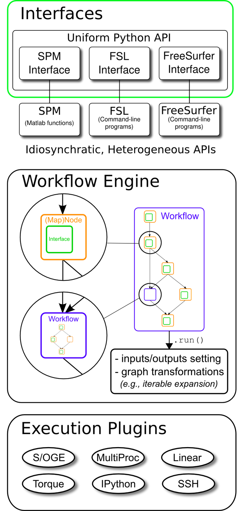
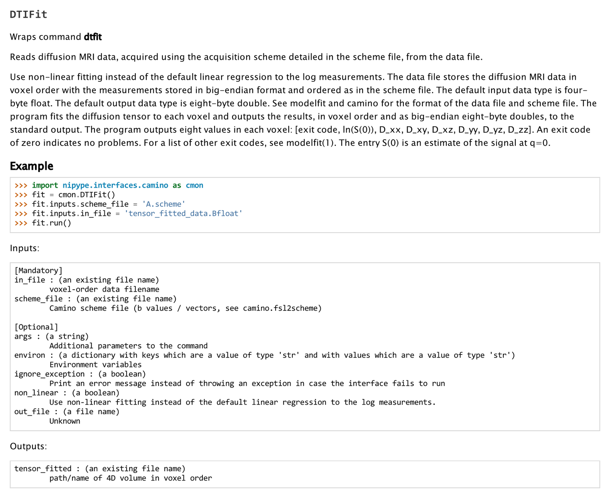
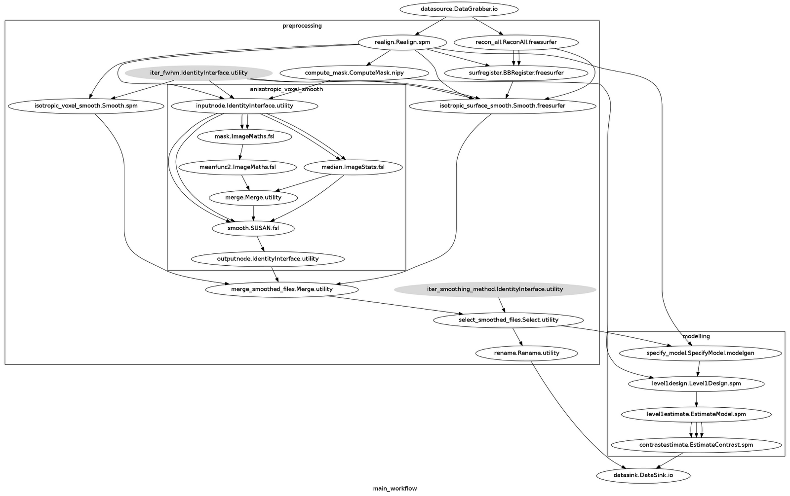
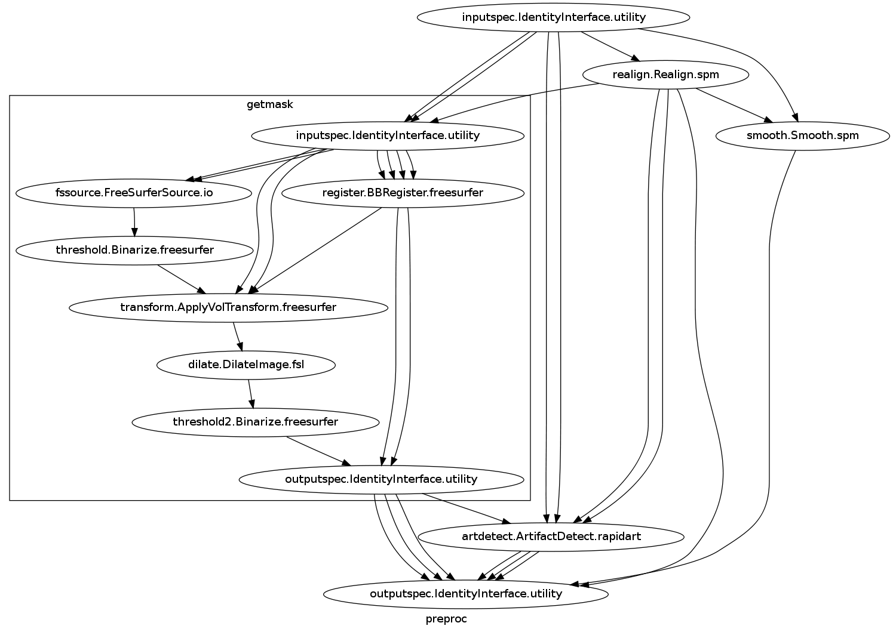

NiPyPe: A flexible, lightweight and extensible neuroimaging data
processing framework in Python

Krzysztof Gorgolewski1, Christopher Burns2, Cindee Madison2, Dav Clark3,
Yaroslav O. Halchenko4, Michael L. Waskom5, Satrajit S. Ghosh6

1 School of Informatics, University of Edinburgh, Edinburgh, UK

2 Helen Wills Neuroscience Institute, University of California,
Berkeley, CA, USA

3 Department of Psychology, University of California, Berkeley, CA, USA

4 Department of Psychological and Brain Sciences, Dartmouth College,
Hanover, NH, USA

5 McGovern Institute for Brain Research, Massachusetts Institute of
Technology, Cambridge, MA, USA

6 Research Laboratory of Electronics, Massachusetts Institute of
Technology, Cambridge, MA, USA

Corresponding author:

Krzysztof Gorgolewski,

University of Edinburgh,

School of Informatics,

Informatics Forum,

EH8 9AB,

Edinburgh,

United Kingdom

e-mail: chris.gorgolewski@gmail.com

Running title: NiPyPe Neuroimaging Data Processing Framework

--------------

Abstract

Current neuroimaging software offer users an incredible opportunity to
analyze their data in different ways, with different underlying
assumptions. Several sophisticated software packages (e.g., AFNI,
BrainVoyager, FSL, FreeSurfer, NiPy, R, SPM) are used to process and
analyze large and often diverse (highly multi-dimensional) data.
However, this heterogeneous collection of specialized applications
creates several issues that hinder replicable, efficient and optimal use
of neuroimaging analysis approaches: 1) No uniform access to
neuroimaging analysis software and usage information; 2) No framework
for comparative algorithm development and dissemination; 3) Personnel
turnover in laboratories often limits methodological continuity and
training new personnel takes time; 4) Neuroimaging software packages do
not address computational efficiency; and 5) Methods sections in journal
articles are inadequate for reproducing results. To address these
issues, we present NiPyPe (Neuroimaging in Python: Pipelines and
Interfaces; http://nipy.org/nipype), an open-source,
community-developed, software package and scriptable library. NiPyPe
solves the issues by providing Interfaces to existing neuroimaging
software with uniform usage semantics and by facilitating interaction
between these packages using Workflows. NiPyPe provides an environment
that encourages interactive exploration of algorithms, eases the design
of Workflows within and between packages, allows rapid comparative
development of algorithms and reduces the learning curve necessary to
use different packages. NiPyPe supports both local and remote execution
on multi-core machines and clusters, without additional scripting.
NiPyPe is BSD licensed, allowing anyone unrestricted usage. An open,
community-driven development philosophy allows the software to quickly
adapt and address the varied needs of the evolving neuroimaging
community, especially in the context of increasing demand for
reproducible research.

Keywords: neuroimaging, data processing, workflow, pipeline,
reproducible research, python

--------------

Introduction
------------

Over the past twenty years, advances in non-invasive in vivo
neuroimaging have resulted in an explosion of studies investigating
human cognition in health and disease. Current imaging studies acquire
multi-modal image data (e.g., structural, diffusion, functional) and
combine these with non-imaging behavioural data, patient and/or
treatment history and demographic and genetic information. Several
sophisticated software packages (e.g., AFNI, BrainVoyager, FSL,
FreeSurfer, NiPy, R, SPM) are used to process and analyze such extensive
data. In a typical analysis, algorithms from these packages, each with
its own set of parameters, process the raw data. However, data collected
for a single study can be diverse (highly multi-dimensional) and large,
and algorithms suited for one dataset may not be optimal for another.
This complicates analysis methods and makes data exploration and
inference challenging, and comparative analysis of new algorithms
difficult.

Current problems
~~~~~~~~~~~~~~~~

Here we outline issues that hinder replicable, efficient and optimal use
of neuroimaging analysis approaches.

1) No uniform access to neuroimaging analysis software and usage
information. For current multi-modal datasets, researchers typically
resort to using different software packages for different components of
the analysis. However, these different software packages are accessed,
and interfaced with, in different ways, such as: shell scripting (FSL,
AFNI, Camino), MATLAB (SPM) and Python (NiPy). This has resulted in a
heterogeneous set of software with no uniform way to use these tools or
execute them. With the primary focus on algorithmic improvement,
academic software development often lacks a rigorous software
engineering framework that involves extensive testing and documentation
and ensures compatibility with other tools. This often necessitates
extensive interactions with the authors of the software to understand
their parameters, their quirks and their usage.

2) No framework for comparative algorithm development and dissemination.
Except for some large software development efforts (e.g., SPM, FSL,
FreeSurfer), most algorithm development happens in-house and stays
within the walls of a lab, without extensive exposure or testing.
Furthermore, testing comparative efficacy of algorithms often requires
significant effort (Klein et al., 2010). In general, developers create
software for a single package (e.g., VBM8 for SPM), create a standalone
cross-platform tool (e.g., Mricron) or simply do not distribute the
software or code (e.g., normalization software used for registering
architectonic atlases to MNI single subject template - REF).

3) Personnel turnover in laboratories often limits methodological
continuity and training new personnel takes time. Most cognitive
neuroscience laboratories aim to understand some aspect of cognition.
Although, a majority of such laboratories gather and analyze
neuroimaging data, very few of them have the personnel with the
technical expertise to understand methodological development and modify
laboratory procedures to adopt new tools. Lab personnel with no prior
imaging experience often learn by following online tutorials, taking
organized courses or, as is most often the case, by learning from
existing members of the lab. While this provides some amount of
continuity, understanding different aspects of neuroimaging has a steep
learning curve, and steeper when one takes into account the time and
resources needed to learn the different package interfaces and
algorithms.

4) Neuroimaging software packages do not address computational
efficiency. The primary focus of neuroimaging analysis algorithms is to
solve problems (e.g., registration, statistical estimation,
tractography). While some developers focus on algorithmic or numerical
efficiency, most developers do not focus on efficiency in the context of
running multiple algorithms on multiple subjects, a common scenario in
neuroimaging analysis. Creating an analysis workflow for a particular
study is an iterative process dependent on the quality of the data and
participant population (e.g., neurotypical, presurgical, etc).
Researchers usually experiment with different methods and their
parameters to create a workflow suitable for their application, but no
suitable framework currently exists to make this process efficient.
Furthermore, very few of the available neuroimaging tools take advantage
of the growing number of parallel hardware configurations (multi-core,
clusters, clouds and supercomputers).

5) Method sections of journal articles are often inadequate for
reproducing results. Several journals (e.g., PNAS, Science, PLoS)
require mandatory submission of data and scripts necessary to reproduce
results of the a study. However, most current method sections do not
have sufficient details to enable a researcher knowledgeable in the
domain to reproduce the analysis process. Furthermore, as discussed
above, typical neuroimaging analyses integrate several tools and current
analysis software do not make it easy to reproduce all the analysis
steps in the proper order. This leaves a significant burden on the user
to satisfy these journal requirements as well as ensure that analysis
details are preserved with the intent to reproduce.

Current solutions

There were several attempts to address those issues by creating a
pipeline engine. Taverna (REF), VisTrails(REF) are general pipelining
systems and do not address problems specific to neuroimaging. BrainVisa
(REF), MIPAV (REF), SPM include their own batch processing tools, but do
not allow mixing components from other packages. Fiswidgets (REF), a
promising initial approach, appears to have not been developed and does
not support state of the art methods. A much more extensive and feature
rich solution is the LONI Pipeline (I. D. Dinov et al., 2009; I. Dinov
et al., 2010; Rex, Ma, & A. W. Toga, 2003). It provides an easy to use
graphical interface for choosing processing steps or nodes from a
predefined library and defining their dependencies and parameters. It
also has extensive support for parallel execution on an appropriately
configured cluster (including data transfer, pausing execution, and
combining local and remote software). Additionally, the LONI Pipeline
saves information about executed steps (such as software origin, version
and architecture) providing provenance information (A. J.
Mackenzie-Graham, J. D. Van Horn, R. P. Woods, Crawford, & A. W. Toga,
2008).

However, the LONI Pipeline does not come without limitations. Processing
nodes are defined using eXtensible Markup Language (XML). This “one size
fits all” method makes it easy to add new nodes as long as they are well
behaved command lines. However, many software packages do not meet this
criterion. For example, SPM, written in MATLAB, does not provide a
command line interface. Furthermore, for several command line programs,
arguments are not easy to describe in the LONI XML schema (e.g., ANTS –
Avants & Gee, 2004). Although it provides a helpful graphical interface,
the LONI Pipeline environment does not provide an easy option to script
a workflow or for rapidly exploring parametric variations within a
workflow (e.g., VisTrails). Finally, due to restrictive licensing, it is
not straightforward to modify and redistribute the modifications.

To address issues with existing workflow systems and the ones described
earlier, we present NiPyPe (Neuroimaging in Python: Pipelines and
Interfaces), an open source, community-developed, Python-based software
package that easily interfaces with existing software for efficient
analysis of neuroimaging data and rapid comparative development of
algorithms. NiPyPe uses a flexible, efficient and general purpose
programming language – Python – as its foundation. Processing modules
and their inputs and outputs are described in an object-oriented manner
providing the flexibility to interface with any type of software (not
just well behaved command lines). The workflow execution engine has a
plug-in architecture and supports both local execution on multi-core
machines and remote execution on clusters. NiPyPe is distributed
with\ :sup:``[a] <#cmnt1>`_`\  a BSD license allowing anyone to make
changes and redistribute it. Development is done openly with
collaborators from many different labs, allowing adaptation to the
varied needs of the neuroimaging community.

--------------

Methods
-------

NiPyPe consists of three components (see Figure 1): 1) interfaces to
external tools that provide a unified way for setting inputs, executing
and retrieving outputs; 2) a workflow engine that allows creating
analysis pipelines by connecting inputs and outputs of interfaces as a
directed acyclic graph (DAG); and 3) plugins that execute workflows
either locally or in a distributed processing environment (e.g.,
Torque\ :sup:``[1] <#ftnt1>`_`\ , SGE/OGE). In the following sections,
we describe key architectural components and features of this software.

Figure 1. Architecture overview of the NiPyPe framework. Interfaces are
wrapped with Nodes or MapNodes and connected together as a graph within
a Workflow. Workflows themselves can act as a Node inside another
Workflow, supporting a composite design pattern. Dependency graph is
transformed before executing by the engine component. Execution is
performed by one of the plugins. Currently NiPyPe supports serial and
parallel (both local multithreading and cluster) execution.

Interfaces
~~~~~~~~~~

Interfaces form the core of NiPyPe. The goal of Interfaces is to provide
a uniform mechanism for accessing analysis tools from neuroimaging
software packages (e.g., FreeSurfer, FSL, SPM). Interfaces can be used
directly as a Python object, incorporated into custom Python scripts or
used interactively in a Python console. For example, there is a Realign
Interface that exposes the SPM realignment routine, while the MCFLIRT
Interface exposes the FSL realignment routine. In addition, one can also
implement an algorithm in Python within NiPyPe and expose it as an
Interface. Interfaces are flexible and can accommodate the heterogeneous
software that needs to be supported, while providing unified and uniform
access to these tools for the user. Since, there is no need for the
underlying software to be changed (recompiled or adjusted to conform
with a certain standard), developers can continue to create software
using the computer language of their choice.

An Interface definition consists of: (a) input parameters, their types
(e.g., file, floating point value, list of integers, etc.,.) and
dependencies (e.g., does input ‘a’ require input ‘b’); (b) outputs and
their types, (c) how to execute the underlying software (e.g., run a
MATLAB script, or call a command line program); and (d) a mapping which
defines the outputs that are produced given a particular set of inputs.
Using an object-oriented approach, we minimize redundancy in interface
definition by creating a hierarchy of base Interface classes (see Figure
2) to encapsulate common functionality (e.g. Interfaces that call
command line programs are derived from the CommandLine class, which
provides methods to translate Interface inputs into command line
parameters and for calling the command.) Source code of an example
Interface is shown in Listing 1.

from nipype.interfaces.base import (

TraitedSpec,

CommandLineInputSpec,

CommandLine,

File

)

import os

class GZipInputSpec(CommandLineInputSpec):

input\_file = File(desc = "File", exists = True, mandatory = True,
argstr = "%s")

class GZipOutputSpec(TraitedSpec):

output\_file = File(desc = "Zip file", exists = True)

class GZipTask(CommandLine):

input\_spec = GZipInputSpec

output\_spec = GZipOutputSpec

cmd = 'gzip'

def \_list\_outputs(self):

outputs = self.output\_spec().get()

outputs['output\_file'] = os.path.abspath(self.inputs.input\_file +\\
".gz")

return outputs

if \_\_name\_\_ == '\_\_main\_\_':

zipper = GZipTask(input\_file='an\_existing\_file')

print zipper.cmdline

zipper.run()

Listing 1. An example interface wrapping the gzip command line tool and
a usage example. This Interface takes a file name as an input, calls
gzip to compress it and returns a name of the compressed output file.

.. figure:: images/image02.png
   :align: center
   :alt: 
Figure 2. Simplified hierarchy of Interface classes. An object-oriented
design is used to reduce code redundancy by defining common
functionality in base classes, and makes adding new interfaces easier
and quicker. MatlabCommand, FSLCommand and FSCommand extend the
CommandLine class to provide functionality specific to executing MATLAB,
FSL and FreeSurfer programs. The SPMCommand class defines functions that
simplify wrapping SPM functionality. The dashed line indicates that the
SPMCommand class uses the MatlabCommand class to execute the SPM matlab
scripts generated by the SPM interfaces.

We use Enthought Traits\ :sup:``[2] <#ftnt2>`_`\  to create a formal
definition for Interface inputs and outputs, to define input constraints
(e.g., type, dependency, whether mandatory) and to provide validation
(e.g., file existence). This allows malformed or underspecified inputs
to be detected prior to executing the underlying program. The input
definition also allows specifying relations between inputs. Often, some
input options should not be set together (mutual exclusion) while other
inputs need to be set as a group (mutual inclusion). Part of the input
specification for the ‘bet’ (Brain Extraction Tool) program from FSL is
shown in Listing 2.

class BETInputSpec(FSLCommandInputSpec):

in\_file = File(exists=True,

desc = 'input file to skull strip',

argstr='%s', position=0, mandatory=True)

out\_file = File(desc = 'name of output skull stripped image',

argstr='%s', position=1, genfile=True)

mask = traits.Bool(desc = 'create binary mask image',

argstr='-m')

functional = traits.Bool(argstr='-F', xor=('functional',
'reduce\_bias'),

desc="apply to 4D fMRI data")

...

Listing 2. Part of the input specification for the Brain Extraction Tool
(BET) Interface. Full specification covers 18 different arguments. Each
attribute of this class is a Traits object which defines an input and
its data type (i.e. list of integers), constraints (i.e. length of the
list), dependencies (when for example setting one option is mutually
exclusive with another, see the xor parameter), and additional
parameters (such as argstr and position which describe how to convert an
input into a command line argument).

Currently, NiPyPe (version 0.4) is distributed with a wide range of
interfaces (see Table supported\_software.). Adding new Interfaces is
simply a matter of writing a Python class definition as was shown in
Listing 1. When a formal specification of inputs and outputs are
provided by the underlying software, NiPyPe can support these programs
automatically. For example, the Slicer command line execution modules
come with an XML specification that allows NiPyPe to wrap them without
creating individual interfaces.

Name

URL

AFNI

afni.nimh.nih.gov/afni

BRAINS

www.psychiatry.uiowa.edu/mhcrc/IPLpages/BRAINS.htm

Camino

www.cs.ucl.ac.uk/research/medic/camino

Camino-TrackVis

www.nitrc.org/projects/camino-trackvis

ConnecomeViewerToolkit

www.connectomeviewer.org

dcm2nii

www.cabiatl.com/mricro/mricron/dcm2nii.html

Diffusion Toolkit

www.trackvis.org/dtk

FreeSurfer

freesurfer.net

FSL

www.fmrib.ox.ac.uk/fsl

NiPy

nipy.org/nipy

NiTime

nipy.org/nitime

Slicer

www.slicer.org/

SPM

www.fil.ion.ucl.ac.uk/spm

SQLite

www.sqlite.org

PyXNAT

github.com/pyxnat, xnat.org

Table supported\_software. List of software packages fully or partially
supported by NiPyPe. For more details
see` <http://www.google.com/url?q=http://nipy.org/nipype/interfaces/index.html&sa=D&sntz=1&usg=AFQjCNGywWOiqWr3hlgDCcEZy7Dr102WUA>`_`http://nipy.org/nipype/interfaces <http://www.google.com/url?q=http://nipy.org/nipype/interfaces/index.html&sa=D&sntz=1&usg=AFQjCNGywWOiqWr3hlgDCcEZy7Dr102WUA>`_

Nodes, MapNodes, and Workflows
~~~~~~~~~~~~~~~~~~~~~~~~~~~~~~

NiPyPe provides a framework for connecting Interfaces to create a data
analysis Workflow. In order for Interfaces to be used in a Workflow they
need to be encapsulated in either Node or MapNode objects. Node and
MapNode objects provide additional functionality to Interfaces. For
example, creating a hash of the input state, caching of results and the
ability to iterate over inputs. Additionally, they execute the
underlying interfaces in their own uniquely named directories (almost
like a sandbox), thus providing a mechanism to isolate and track the
outputs resulting from executing the Interfaces. These mechanisms allow
not only for provenance tracking, but aid in efficient pipeline
execution.

The MapNode class is a sub-class of Node that implements a
MapReduce-like architecture (Dean and Ghemawat 2008). Encapsulating an
Interface within a MapNode allows Interfaces that normally operate on a
single input to execute the Interface on multiple inputs. When a MapNode
executes, it creates a separate instance of the underlying Interface for
every value of an input list and executes these instances independently.
When all instances finish running, their results are collected into a
list and exposed through the MapNode’s outputs (see Figure 4D). This
approach improves granularity of the Workflow and provides easy support
for Interfaces that can only process one input at a time. For example,
the FSL ‘bet’ program can only run on a single input, but wrapping the
BET Interface in a MapNode allows running ‘bet’ on multiple inputs.

A Workflow object captures the processing stages of a pipeline and the
dependencies between these processes. Interfaces encapsulated into Node
or MapNode objects can be connected together within a Workflow. By
connecting outputs of some Nodes to inputs of others, the user
implicitly specifies dependencies. These are represented internally as a
directed acyclic graph (DAG). The current semantics of Workflow do not
allow conditionals and hence the graph needs to be acyclic. Workflows
themselves can be a node of the Workflow graph (see Figure 1). This
enables a hierarchical architecture and encourages Workflow reuse. The
Workflow engine validates that all nodes have unique names, ensures that
there are no cycles, and prevents connecting multiple outputs to a given
input. For example in an fMRI processing Workflow, preprocessing, model
fitting and visualization of results can be implemented as individual
Workflows connected together in a main Workflow. This not only improves
clarity of designed Workflows but also enables easy exchange of whole
subsets. Common Workflows can be shared across different studies within
and across laboratories thus reducing redundancy and increasing
consistency.

While a neuroimaging processing pipeline could be implemented as a Bash,
MATLAB or a Python script, NiPyPe explicitly implements a pipeline as a
graph. This makes it easy to follow what steps are being executed and in
what order. It also makes it easier to go back and change things by
simply reconnecting different outputs and inputs or by inserting new
Nodes/MapNodes. This alleviates the tedious component of scripting where
one has to manually ensure that the inputs and outputs of different
processing calls match and that operations do not overwrite each others
outputs.

A Workflow provides a detailed description of the processing steps and
how data flows between Interfaces. Thus it is also a source of
provenance information. We encourage users to provide Workflow
definitions (as scripts or graphs) as supplementary material when
submitting articles. This ensures that at least the data processing part
of the published experiment is fully reproducible. Additionally,
exchange of Workflows between researchers stimulates efficient use of
methods and experimentation.

Example - building a Workflow from scratch
~~~~~~~~~~~~~~~~~~~~~~~~~~~~~~~~~~~~~~~~~~

In this section, we describe how to create and extend a typical fMRI
processing Workflow. A typical fMRI Workflow can be divided into two
sections: 1) preprocessing and 2) modeling. The first one deals with
cleaning data from confounds and noise and the second one fits a model
to the cleaned data based on the experimental design. The preprocessing
stage in this Workflow will consist of only two steps: 1) motion
correction (aligns all volumes in a functional run to the mean realigned
volume) and 2) smoothing (convolution with a 3D Gaussian kernel). We use
SPM Interfaces to define the processing Nodes.

from nipype.pipeline.engine import Node, Workflow

realign = Node(interface=spm.Realign(), name="realign")

realign.inputs.register\_to\_mean = True

smooth = Node(interface=spm.Smooth(), name="smooth")

smooth.inputs.fwhm = 4

We create a Workflow to include these two Nodes and define the data flow
from the output of the realign Node (realigned\_files) to the input of
the smooth Node (in\_files). This creates a simple preprocessing
workflow (see Figure 3).

preprocessing = Workflow(name="preprocessing")

preprocessing.connect(realign, "realigned\_files", smooth, "in\_files")

A modeling Workflow is constructed in an analogous manner, by first
defining Nodes for model design, model estimation and contrast
estimation. We again use SPM Interfaces for this purpose. However,
NiPyPe adds an extra abstraction Interface for model specification whose
output can be used to create models in different packages (e.g., SPM,
FSL and NiPy). The nodes of this Workflow are: SpecifyModel (NiPyPe
model abstraction Interface), Level1Design (SPM design definition),
ModelEstimate, and ContrastEstimate. The connected modeling Workflow can
be seen on Figure 3.

We create a master Workflow that connects the preprocessing and modeling
Workflows, adds the ability to select data for processing (using
DataGrabber Interface) and a DataSink Node to save the outputs of the
entire Workflow. NiPyPe allows connecting Nodes between Workflows. We
will use this feature to connect realignment\_parameters and
smoothed\_files to modeling workflow.

The DataGrabber Interface allows the user to define flexible search
patterns which can be parameterized by user defined inputs (such as
subject ID, session etc.). This Interface can adapt to a wide range of
directory organization and file naming conventions. In our case we will
parameterize it with subject ID. In this way we can run the same
Workflow for different subjects. We automate this by iterating over a
list of subject IDs, by setting the iterables property of the
DataGrabber Node for the input subject\_id. The DataGrabber Node output
is connected to the realign Node from preprocessing Workflow.

DataSink on the other side provides means for storing selected results
in a specified location. It supports automatic creation of folders,
simple substitutions and regular expressions to alter target filenames.
In this example we store the statistical (T maps) resulting from
contrast estimation.

A Workflow defined this way (see Figure 3, for full code see
Supplementary material) is ready to run. This can be done by calling
run() method of the master Workflow.

If the run() method is called twice, the Workflow input hashing
mechanism ensures that none of the Nodes are executed during the second
run if the inputs remain the same. If, however, a highpass filter
parameter of specify\_model is changed, some of the Nodes (but not all)
would have to rerun. NiPyPe automatically determines which Nodes require
rerunning.

Figure 3. Graph depicting the processing steps and dependencies for a
first level functional analysis workflow. Every output-input connection
is represented with a separate arrow. Nodes from every subworkflow are
grouped in boxes with labels corresponding to the name of the
subworkflow. Such graphs can be automatically generated from a Workflow
definition and provide a quick overview of the pipeline.

Iterables - Parameter space exploration
~~~~~~~~~~~~~~~~~~~~~~~~~~~~~~~~~~~~~~~

NiPyPe provides a flexibile approach to prototype and experiment with
different processing strategies, by providing unified and uniform access
to a variety of software packages (Interfaces) and creating data flows
(Workflows). However, for various neuroimaging tasks, there is often a
need to explore the impact of variations in parameter settings (e.g.,
how do different amounts of smoothing affect group statistics, what is
the impact of spline interpolation over trilinear interpolation, ). To
enable such parametric exploration, Nodes have an attribute called
iterables.

When an iterable is set on a Node input, the Node and its subgraph are
executed for each value of the iterable input (see Figure
iterables\_vs\_mapnode). Iterables can also be set on multiple inputs of
a Node (e.g., somenode.iterables = [(‘input1’, [1,2,3]), (‘input2’,
[‘a’, ‘b’])]). In such cases, every combination of those values is used
as a parameter set (the prior example would result in the following
parameter sets: (1, ‘a’), (1, ‘b’), (2, ‘a’), etc.,.). This feature is
especially useful to investigate interactions between parameters of
intermediate stages with respect to the final results of a workflow. A
common use-case of iterables is to execute the same Workflow for many
subjects in an fMRI experiment and to simultaneously look at the impact
of parameter variations on the results of the Workflow.

It is important to note that unlike MapNode, which creates copies of the
underlying interface for every element of an input of type list,
iterables operate on the subgraph of a node and creates copies of not
only the node but also all the nodes dependent on it (see Figure 4).

|image0|Figure 4. Workflow modification using iterables and MapNodes. If
we take the processing pipeline A and set iterables parameter of
DataGrabber to a list of two subjects, NiPyPe will effectivelly execute
graph B. Identical processing will be applied to every subject from the
list. Iterables can be used in a graph on many levels. For example,
setting iterables on Smooth FWHM to a list of 4 and 8 mm will result in
graph C. In contrast to iterables, MapNode branches within a node of the
graph and also merges the results of the branches, effectively
performing a MapReduce operation (D).

Parallel Distribution and Execution Plug-ins
~~~~~~~~~~~~~~~~~~~~~~~~~~~~~~~~~~~~~~~~~~~~

NiPyPe supports executing Workflows locally (in series or parallel) or
on load-balanced grid-computing clusters (e.g., SGE, Torque or even via
SSH) through an extensible plug-in interface. No change is needed to the
Workflow to switch between these execution modes. One simply calls the
Workflow’s run function with a different plug-in and its arguments. Very
often different components of a Workflow can be executed in parallel and
even more so when the same Workflow is being repeated on multiple
parameters (e.g., subjects). Adding support for additional cluster
management systems does not require changes in NiPyPe, but simply
writing a plug-in extension conforming to the plug-in API.

The Workflow engine sends an execution graph to the plug-in. Executing
the Workflow in series is then simply a matter of performing a
topological sort on the graph and running each node in the sorted order.
However, NiPyPe also provides additional plugins that use Python’s
multi-processing module, use IPython (includes ssh-based, SGE, LSF, PBS,
among others) and provide native interfaces to SGE or PBS/Torque
clusters. For all of these, the graph structure defines the dependencies
as well as which nodes can be executed in parallel at any given stage of
execution.

One of the biggest advantages of NiPyPe’s execution system is that
parallel execution using local multi processing plug-in does not require
any additional software (such as cluster managers like SGE) and
therefore makes prototyping on a local multi-core workstations easy.
However for bigger studies and complex Workflows, a high-performance
computing cluster can provide substantial improvements in execution
time. Since there is a clear separation between definition of the
Workflow and its execution, Workflows do not need to be modified to be
executed in parallel (locally or on a cluster). Transitioning from
developing a processing pipeline on a single subject on a local
workstation to executing it on a bigger cohort on a cluster is therefore
seamless.

Rerunning workflows has also been optimized. When a Node or MapNode is
run, the framework will actually execute the underlying interface only
if inputs have changed relative to prior execution. If not, it will
simply return cached results.\ :sup:``[b] <#cmnt2>`_`\ 

The Function Interface
~~~~~~~~~~~~~~~~~~~~~~

One of the Interfaces implemented in NiPyPe requires special attention:
The Function Interface. Its constructor takes as arguments Python
function pointer or code, list of inputs and list of outputs. This
allows running any Python code as part of a Workflow. When combined with
libraries such as Nibabel (neuroimaging data input and output),
Numpy/Scipy (array representation and processing) and scikits-learn
(machine learning and data mining) the Function Interface provides means
for rapid prototyping of complex data processing methods. In addition,
by using the Function Interface user can avoid writing own Interfaces
which is especially useful for ad-hoc solutions (e.g., calling an
external program that has not yet been wrapped as an Interface).

Workflow Visualisation
~~~~~~~~~~~~~~~~~~~~~~

To be able to efficiently manage and debug Workflow one has to have
access to a graphical representation. Using graphviz
(Ref)\ :sup:``[c] <#cmnt3>`_`\ , NiPyPe generates static graphs
representing Nodes and connections between them. In the current version
four types of graphs are supported: orig – does not expand inner
Workflows, flat – expands inner workflows, exec – expands workflows and
iterables, and hierarchical – expands workflows but maintains their
hierarchy. Graphs can be saved in a variety of file formats including
Scalable Vector Graphics (SVG) and Portable Network Graphics (PNG) (see
Figures workflow\_from\_scratch and smoothing\_comparison\_workflow for
an examples)

Configuration Options
~~~~~~~~~~~~~~~~~~~~~

Certain options concerning verbosity of output and execution efficiency
can be controlled through configuration files or variables. These
include, among others, hash\_method and remove\_unecessary\_outputs. As
explained before, rerunning a Workflow only recomputes those Nodes whose
inputs have changed since the last run. This is achieved by recording a
hash of the inputs. For files there are two ways of calculating the hash
(controlled by the hash\_method config option): timestamp – based only
on the size and modification time and content – based on the content of
the file. The first one is faster, but does not deal with situation when
the file is overwritten by an identical copy. The second one can be
slower especially for big files, but can tell that two files are
identical even if they have different modification times. To allow
efficient recomputation NiPyPe has to store outputs of all Nodes. This
can generate a significant amount of data for typical neuroimaging
studies. However, not all outputs of every Node are used as inputs to
other Nodes or relevant to the final results. Users can decide to remove
those outputs (and save some disk space) by setting the
remove\_unecessary\_outputs to True. These and other configuration
options provide a mechanism to streamline the use of NiPyPe for
different applications.

Deployment
~~~~~~~~~~

NiPyPe supports GNU/Linux and Mac OS X operating systems. We currently
provide three ways of deploying it on a new machine: manual installation
from sources (`http://nipy.org/nipype/ <http://nipy.org/nipype/>`_),
PyPi repository
(`http://pypi.python.org/pypi/nipype/ <http://pypi.python.org/pypi/nipype/>`_),
and from package repositories on Debian-based systems. Manual
installation involves downloading a source code archive and running a
standard Python installation script (distutils). This way user has to
take care of installing all of the dependencies. Installing from PyPI
repository lifts this constraint by providing dependency information and
automatically installing required packages. NiPyPe is available from
standard repositories on recent Debian and Ubuntu releases. Moreover,
NeuroDebian (http://neuro.debian.net - Hanke et al. 2010) repository
provides the most recent releases of NiPyPe for Debian-based systems and
a NeuroDebian Virtual Appliance making it possible to deploy NiPyPe and
other imaging tools in a virtual environment on several operating
systems. In addition to providing all core dependencies and automatic
updates NeuroDebian also provides many of the software packages
supported by NiPyPe (AFNI, FSL, Mricron, etc), making deployment of
heterogeneous NiPyPe pipelines more straightforward.

Development
~~~~~~~~~~~

NiPyPe is trying to address the problem of interacting with ever
changing universe of neuroimaging software in a sustainable manner.
Therefore the way its development is managed is a part of the solution.
NiPyPe is distributed under BSD license which allows free copying,
modification and distribution and additionally meets all the
requirements of open source definition (see Open Source
Initiative\ :sup:``[3] <#ftnt3>`_`\ ) and Debian Free Software
Guidelines\ :sup:``[4] <#ftnt4>`_`\ . Development is carried out openly
through distributed version control system (git via
GitHub\ :sup:``[5] <#ftnt5>`_`\ ) in an online community. The current
version of the source code together with complete history is accessible
to everyone. Discussions between developers and design decisions are
done on an open access mailing list. Such setup encourages a broader
community of developers to join the project and allows sharing of the
development resources (effort, money, information and time).

In these previous paragraphs, we presented key features of NiPyPe that
facilitate rapid development and deployment of analysis procedures in
laboratories, and address all of the issues described earlier. In
particular, NiPyPe provides: 1) uniform access to neuroimaging analysis
software and usage information; 2) a framework for comparative algorithm
development and dissemination; 3) an environment for methodological
continuity and paced training of new personnel in laboratories; 4)
computationally efficient execution of neuroimaging analysis; and 5) a
mechanism to capture the data processing details in compact scripts and
graphs. In the following section, we provide examples to demonstrate
these solutions.

--------------

Results
-------

Uniform accessing to tools, their usage, and execution
~~~~~~~~~~~~~~~~~~~~~~~~~~~~~~~~~~~~~~~~~~~~~~~~~~~~~~

Users access Interfaces by importing them from NiPyPe modules. Each
neuroimaging software distribution such as FSL, SPM, Camino, etc., has a
corresponding module in the nipype.interfaces namespace.

>>> from nipype.interfaces.camino import DTIFit

The help() function for each interface prints the inputs and the outputs
associated with the interface.

>>> DTIFit.help()

Inputs
------
Mandatory:
 in\_file: voxel-order data filename
 scheme\_file: Camino scheme file (b values / vectors, see
camino.fsl2scheme)
Optional:
 args: Additional parameters to the command
 environ: Environment variables (default={})
 ignore\_exception: Print an error message instead of throwing an
exception in case the interface fails to run (default=False)
 non\_linear: Use non-linear fitting instead of the default linear
regression to the log measurements.
 out\_file: None
Outputs
-------
tensor\_fitted: path/name of 4D volume in voxel order

The output of the help() function is standardized across all Interfaces.
It is automatically generated based on the traited input and output
definitions and includes information about required inputs, types, and
default value. Alternatively, extended information is available in the
form of auto-generated HTML documentation on the NiPyPe website (see
Figure 5). This extended information includes examples that demonstrate
how the interface can be used.

For every Interface, input values are set through the inputs field:

>>> fit.inputs.scheme\_file = 'A.scheme'

>>> fit.inputs.in\_file = 'tensor\_fitted\_data.Bfloat'

When trying to set an invalid input type (for example a non existing
input file, or a number instead of a string) NiPyPe framework will
display an error message. Input validity checking before actual Workflow
execution saves time. To run an Interface user needs to call run()
method:

>>> fit.run()

At this stage the framework checks if all mandatory inputs are set and
all input dependencies are satisfied, generating an error if either of
these conditions are not met.

NiPyPe standardizes running and accessing help information irrespective
of whether the underlying software is a MATLAB program, a command line
tool or Python module. The framework deals with translating inputs into
appropriate form (e.g., command line arguments or MATLAB scripts) for
executing the underlying tools in the right way, while presenting the
user with a uniform interface.

Figure 5. HTML help page for dtfit command from Camino. This was
generated based on the Interface code: description and example was taken
from the class docstring and inputs/outputs were list was created using
traited input/output specification.

A framework for comparative algorithm development and dissemination
~~~~~~~~~~~~~~~~~~~~~~~~~~~~~~~~~~~~~~~~~~~~~~~~~~~~~~~~~~~~~~~~~~~

Uniform semantics for interfacing with a wide range of processing
methods not only opens the possibility for richer Workflows, but also
allows comparing algorithms that are designed to solve the same problem
across and within such diverse Workflows. Typically, such an exhaustive
comparison can be time-consuming, because of the need to deal with
interfacing different software packages. NiPyPe simplifies this process
by standardizing the access to the software. Additionally, the iterables
mechanism allows users to easily extend such comparisons by providing a
simple mechanism to test different parameter sets.

Accuracy or efficiency of algorithms can be determined in an isolated
manner by comparing their outputs or execution time or memory
consumption on a given set of data. However, researchers typically want
to know how different algorithms used at earlier stages of processing
might influence the final output or statistics they are interested in.
As an example of such use, we have compared voxelwise isotropic,
voxelwise anisotropic and surface based smoothing all for two levels of
FWHM - 4 and 8mm. First one is the standard convolution with Gaussian
kernel as implemented in SPM. Second one involves smoothing only voxels
of similar intensity in attempt to retain structure. This was
implemented in SUSAN from FSL (S.M. Smith, 1992). Third method involves
reconstructing surface of the cortex and smoothing along it (Hagler Jr.,
Saygin, & Sereno, 2006). This avoids bleeding of signal over sulci.

Establishing parameters from data and smoothing using SUSAN is already
built into NiPyPe as a Workflow. It can be created using
create\_susan\_smooth() function. It has similar inputs and outputs as
SPM Smooth Interface. Smoothing on a surface involves doing a full
cortical reconstruction from T1 volume using FreeSurfer (Fischl, Sereno,
& Dale, 1999) followed by coregistering functional images to the
reconstructed surface using BBRegister (REF\ :sup:``[d] <#cmnt4>`_`\ ).
Finally, surface smoothing algorithm from FreeSurfer is called.

Smoothed EPI volumes (direct/local influence) and statistical maps
(indirect/global influence), along with the pipeline used to generate
them can be found in Figure 6 and 7. Full code used to generate this
data can be found in the supplementary material. This comparison serves
only to demonstrate NiPyPe capabilities; a comparison between smoothing
methods is outside of the scope of this paper.

Figure 6. Graph showing the workflow used for the smoothing methods and
parameters comparison. The gray shaded nodes have iterables parameter
set. This allows to easily iterate over all combinations of FWHM and
smoothing algorithms used in the comparison.

.. figure:: images/image03.png
   :align: center
   :alt: 
Figure 7. Influence of different smoothing methods and their parameters.
Upper half shows direct influence of smoothing on the EPI sequence
(slice 16, volume 0, run 2). Lower half shows indirect influence of
smoothing on the T maps (same slice) of the main contrast.

Algorithm comparison is not the only way NiPyPe can be useful for a
neuroimaging methods researcher. It is in the interest of every methods
developer to make his or hers work most accessible. This usually means
providing ready to use implementations. However, because the field is so
diverse, software developers have to provide several packages (SPM
toolbox, command line tool, C++ library etc.) to cover the whole user
base. With NiPyPe, a developer can create one Interface and expose a new
tool, written in any language, to a greater range of users, knowing it
will work with the wide range of software currently supported by NiPyPe.

A good example of such scenario is ArtifactDetection
toolbox\ :sup:``[6] <#ftnt6>`_`\ . This piece of software uses EPI
timeseries and realignment parameters to find timepoints (volumes) that
are most likely artifacts and should be removed (by including them as
confound regressors in the design matrix). The tool was initially
implemented as a MATLAB script, compatible only with SPM and used
locally within the lab. The current NiPyPe interface can work with SPM
or FSL Workflows, thereby not limiting its users to SPM.

An environment for methodological continuity and paced training of new
personnel in laboratories
~~~~~~~~~~~~~~~~~~~~~~~~~~~~~~~~~~~~~~~~~~~~~~~~~~~~~~~~~~~~~~~~~~~~~~~~~~~~~~~~~~~~~~~~~~~~~~~~

Neuroimaging studies in any laboratory typically use similar data
processing methods with possibly different parameters. NiPyPe Workflows
can be very useful in dividing the data processing into reusable
building blocks. This not only improves the speed of building new
Workflows but also reduces the number of potential errors, because a
well tested piece of code is being reused (instead of being
reimplemented every time). Since a Workflow definition is an abstract
and simplified representation of the data processing stream, it is much
easier to describe and hand over to new project personnel. Furthermore,
a data independent Workflow definition (see Figure 8) enables sharing
Workflows within and across research laboratories. NiPyPe provides a
high-level abstraction mechanism for exchanging knowledge and expertise
between researchers focused on methods in neuroimaging and those
interested in applications.

The uniform access to Interfaces and the ease of use of Workflows in
NiPyPe helps with training new staff. Composition provided by Workflows
allows users to gradually increase the level of details when learning
how to perform neuroimaging analysis. For example user can start with a
“black box” Workflow that does analysis from A-Z, and gradually learn
what the sub-components (and their sub-components) do. Playing with
Interfaces in an interactive console is also a great way to learn how
different algorithms work with different parameters without having to
understand how to set them up and execute them.

Figure 8. create\_spm\_preproc() functions returns this reusable, data
independent Workflow. It implements typical fMRI preprocessing with
smoothing (SPM), motion correction (SPM), artefact detection (NiPyPe)
and coregistration (FreeSurfer). Inputs and outputs are grouped using
IdentityInterfaces. Thanks this changes in the configuration of the
nodes will not break backward compatibility. For full source code see
Supplementary Material.

Computationally efficient execution of neuroimaging analysis
~~~~~~~~~~~~~~~~~~~~~~~~~~~~~~~~~~~~~~~~~~~~~~~~~~~~~~~~~~~~

A computationally efficient execution allows for multiple
rapid-iterations to optimize a Workflow for a given application. Support
for optimized local execution (running independent processes in
parallel, rerunning only those steps that have been influenced by the
changes in parameters or dependencies since the last run) and
exploration of parameter space eases Workflow development. The NiPyPe
package provides a seamless and flexible environment for executing
Workflows in parallel on a variety of environments from local multi-core
workstations to high-performance clusters. In the SPM workflow for
single subject functional data analysis (see Figure 9), only a few
components can be parallelized. However, running this Workflow across
several subjects provides room for embarrassingly parallel execution.
Running this Workflow in distributed mode for 69 subjects on a compute
cluster (40 cores distributed across 6 machines) took 1 hour and 40
minutes relative to the 32 minutes required to execute the analysis
steps in series for a single subject on the same cluster. The difference
from the expected runtime of 64 minutes (32 minutes for the first 40
subjects and another 32 minutes for the remaining 29 subjects) stems
from disk I/O and other network and processing resource bottlenecks.

Figure 9. Single subject fMRI Workflow used for benchmarking parallel
execution.

Captures details of analysis required to reproduce results

The graphs and code presented in the examples above capture all the
necessary details to rerun the analysis. Any user who has the same
versions of the tools installed on their machine and access to the data
and scripts, will be able to reproduce the results of the study. For
example, running NiPyPe within the NeuroDebian framework can provide
access to specific versions of the underlying tools. This provides an
easy mechanism to be compliant with the submitting data and scripts/code
mandates of journals such as PNAS and Science.

Discussion

Current neuroimaging software offer users an incredible opportunity to
analyze their data in different ways, with different underlying
assumptions. However, this heterogeneous collection of specialized
applications creates several problems: 1) No uniform access to
neuroimaging analysis software and usage information; 2) No framework
for comparative algorithm development and dissemination; 3) Personnel
turnover in laboratories often limit methodological continuity and
training new personnel takes time; 4) Neuroimaging software packages do
not address computational efficiency; and 5) Method sections of journal
articles are often inadequate for reproducing results.

We addressed these issues by creating NiPyPe, an open-source,
community-developed initiative under the umbrella of NiPy. NiPyPe,
solves these issues by providing uniform Interfaces to existing
neuroimaging software and by facilitating interaction between these
packages within Workflows. NiPyPe provides an environment that
encourages interactive exploration of algorithms from different packages
(e.g., SPM, FSL), eases the design of Workflows within and between
packages, and reduces the learning curve necessary to use different
packages. NiPyPe is addressing limitations of existing pipeline systems
and creating a collaborative platform for neuroimaging software
development in Python, a high-level scientific computing language.

We use Python for several reasons. It has extensive scientific computing
and visualization support through packages such as SciPy, NumPy,
Matplotlib and Mayavi (Millman & Aivazis, 2011; Pérez, Granger, &
Hunter, 2010) . The Nibabel package provides support for reading and
writing common neuroimaging file formats (e.g., NIFTI, ANALYZE and
DICOM). Being a high-level language, Python supports rapid prototyping,
is easy to learn and adopt and is available across all major operating
systems. Python is also known to be a good choice for the first
programming language to learn (Zelle 1999) and is chosen as the language
for introductory programming at many schools and
universities\ :sup:``[7] <#ftnt7>`_`\ . Being a generic and free
language, with various extensions available "out of the box", it has
allowed many researchers to start implementing and sharing their ideas
with minimal knowledge of Python while learning more of the language and
programming principles along the way. Many such endeavors later on
became popular community-driven FOSS projects, attracting users and
contributors, and even outlasting the involvement of the original
authors. Python has already been embraced by the neuroscientific
community and is rapidly gaining popularity (Bednar, 2009; Goodman &
Brette, 2009). The Connectome Viewer Toolkit(REF), DiPy(REF),
NiBabel\ :sup:``[8] <#ftnt8>`_`\ , NiPy\ :sup:``[9] <#ftnt9>`_`\ ,
NiTime(REF), PyMVPA (REF), PyXNAT (REF) and
Scikits-Learn\ :sup:``[10] <#ftnt10>`_`\  are just a few examples of
neuroimaging related software written in Python. NiPyPe, based on
Python, thus has immediate access to this extensive community and its
software, technological resources and support structure.

NiPyPe provides a formal and flexible framework to accommodate the
diversity of imaging software. Within neuroimaging community, not all
software are limited to well behaved command line tools. Furthermore, a
number of these tools do not have well defined inputs, outputs or usage
help. Although, currently we use Enthought Traits to define inputs and
outputs of interfaces, such definitions could be easily translated into
instances of XML schemas compatible with other pipeline frameworks. On
the other hand, when a tool provides a formal XML description of their
inputs and outputs (e.g., Slicer 3D, BRAINS), it is possible to take
these definitions and automatically generate NiPyPe wrappers for those
classes.
~~~~~~~~~~~~~~~~~~~~~~~~~~~~~~~~~~~~~~~~~~~~~~~~~~~~~~~~~~~~~~~~~~~~~~~~~~~~~~~~~~~~~~~~~~~~~~~~~~~~~~~~~~~~~~~~~~~~~~~~~~~~~~~~~~~~~~~~~~~~~~~~~~~~~~~~~~~~~~~~~~~~~~~~~~~~~~~~~~~~~~~~~~~~~~~~~~~~~~~~~~~~~~~~~~~~~~~~~~~~~~~~~~~~~~~~~~~~~~~~~~~~~~~~~~~~~~~~~~~~~~~~~~~~~~~~~~~~~~~~~~~~~~~~~~~~~~~~~~~~~~~~~~~~~~~~~~~~~~~~~~~~~~~~~~~~~~~~~~~~~~~~~~~~~~~~~~~~~~~~~~~~~~~~~~~~~~~~~~~~~~~~~~~~~~~~~~~~~~~~~~~~~~~~~~~~~~~~~~~~~~~~~~~~~~~~~~~~~~~~~~~~~~~~~~~~~~~~~~~~~~~~~~~~~~~~~~~~~~~~~~~~~~~~~~~~~~~~~~~~~~~~~~~~~~~~~~~~~~~~~~~~~~~~~~~~~~~~~~~~~~~~~~~~~~~~~~~~~~~~~~~~~~~~~~~~~~~~~~~~~~~~~~~~~~~~~~~~~~~~~~~~~~~~~~~~~~~~~~~~~~~~~~~~~~~~~~~~~~~~~~~~~~~~~~~~~~~~~~~~~~~~~~~~~~~~~~~~~~~~~~~~~~~~~~~~~~~~~~~~~~~~~~~~~~~~~~

NiPyPe development welcomes input and contributions from the community.
The source code is freely distributed under a Berkeley Software
Distribution (BSD) license allowing anyone any use of the software and
NiPyPe conforms to the Open Software Definition of the Open Source
Initiative. Development process is fully transparent and encourages
contributions from users from all around the world. The diverse and
geographically distributed user and developer base makes NiPyPe a
flexible project that takes into account needs of many scientists.

Improving openness, transparency, and reproducibility of research has
been a goal of NiPyPe since its inception. A Workflow definition is, in
principle, sufficient to reproduce the analysis. Since it was used to
actually analyze the data it is more detailed and accurate than a
typical methods description in a paper, but also has the advantage of
being reused and shared within and across laboratories. Accompanying a
publication with a formal definition of the processing pipeline (such as
a NiPyPe script) increases reproducibility and transparency of research.
The Interfaces and Workflows of NiPyPe capture neuroimaging analysis
knowledge and the evolution of methods. Although, at the execution
level, NiPyPe captures a variety of provenance information, this aspect
can be improved by generating provenance reports defined by a
standardized XML schema (Mackenzie-Graham, Van Horn, Woods, Crawford, &
Toga, 2008).

Increased diversity of neuroimaging data processing software has made
systematic comparison of performance and accuracy of underlying
algorithms essential (for examples, see Klein et al., 2009; 2010).
However, a platform for comparing algorithms, either by themselves or in
the context of an analysis workflow, or determining optimal workflows in
a given application context (e.g., Churchill et al., 2011), does not
exist. Furthermore, in this context of changing hardware and software,
traditional analysis approaches may not be suitable in all contexts
(e.g., data from 32-channel coils which show a very different
sensitivity profile, or data from children). NiPyPe can make such
evaluations, design of optimal workflows and investigations easier (as
demonstrated via the smoothing example above), resulting in more
efficient data analysis for the community.

Summary
~~~~~~~

We presented NiPyPe, an extensible Python library and framework that
provides interactive manipulation of neuroimaging data through uniform
Interfaces and enables reproducible, distributed analysis using the
Workflow system. Nipype has encouraged the scientific exploration of
different algorithms and associated parameters, eased the development of
Workflows within and between packages and reduced the learning curve
associated with understanding the algorithms, APIs and user interfaces
of disparate packages. An open, community-driven development philosophy
provides flexibility required to address the diverse needs in
neuroimaging analysis. Overall, NiPyPe represents an effort towards
collaborative, open-source, reproducible and efficient neuroimaging
software development and analysis.

Acknowledgements

A list of people who have contributed code to the project is available
at http://github.com/nipy/nipype/contributors. We thank Fernando Perez,
Matthew Brett, Gael Varoquaux, Jean-Baptiste Poline, Bertrand Thirion,
Stephan Gerhard, Alexis Roche and Jarrod Millman for technical and
social support and for design discussions. We would like to thank Prof.
John Gabrieli’s laboratory at MIT for testing NiPyPe through its
evolutionary stages, in particular, Tyler Perrachione and Gretchen
Reynolds. We would also like to thank the developers of FreeSurfer, FSL
and SPM for being supportive of the project and providing valuable
feedback on technical issues. We would like to thank XX for providing
feedback during the preparation of the manuscript. Satrajit Ghosh would
like to acknowledge support from NIBIB R03 EB008673 (PI: Ghosh and
Whitfield-Gabrieli), the Ellison Medical Foundation, Katrien Vander
Straeten and Amie Ghosh. Krzysztof Gorgolewski would like to thank Mark
Bastin, Cyril Pernet, and Amos Storkey for their supervision.

--------------

Supplementary Material

workflow\_from\_scratch.py

import NiPyPe.interfaces.io as nio # Data i/o

import NiPyPe.interfaces.spm as spm # spm

import NiPyPe.pipeline.engine as pe # pypeline engine

import NiPyPe.algorithms.modelgen as model # model specification

from NiPyPe.interfaces.base import Bunch

import os # system functions

realign = pe.Node(interface=spm.Realign(), name="realign")

realign.inputs.register\_to\_mean = True

smooth = pe.Node(interface=spm.Smooth(), name="smooth")

smooth.inputs.fwhm = 4

preprocessing = pe.Workflow(name="preprocessing")

preprocessing.connect(realign, "realigned\_files", smooth, "in\_files")

specify\_model = pe.Node(interface=model.SpecifyModel(),
name="specify\_model")

specify\_model.inputs.input\_units = 'secs'

specify\_model.inputs.time\_repetition = 3.

specify\_model.inputs.high\_pass\_filter\_cutoff = 120

specify\_model.inputs.subject\_info =
[Bunch(conditions=['Task-Odd','Task-Even'],onsets=[range(15,240,60),range(45,240,60)],durations=[[15],
[15]])]\*4

level1design = pe.Node(interface=spm.Level1Design(), name=
"level1design")

level1design.inputs.bases = {'hrf':{'derivs': [0,0]}}

level1design.inputs.timing\_units = 'secs'

level1design.inputs.interscan\_interval =
specify\_model.inputs.time\_repetition

level1estimate = pe.Node(interface=spm.EstimateModel(),
name="level1estimate")

level1estimate.inputs.estimation\_method = {'Classical' : 1}

contrastestimate = pe.Node(interface = spm.EstimateContrast(),
name="contrastestimate")

cont1 = ('Task>Baseline','T', ['Task-Odd','Task-Even'],[0.5,0.5])

cont2 = ('Task-Odd>Task-Even','T', ['Task-Odd','Task-Even'],[1,-1])

contrastestimate.inputs.contrasts = [cont1, cont2]

modeling = pe.Workflow(name="modeling")

modeling.connect(specify\_model, 'session\_info', level1design,
'session\_info')

modeling.connect(level1design, 'spm\_mat\_file', level1estimate,
'spm\_mat\_file')

modeling.connect(level1estimate,'spm\_mat\_file',
contrastestimate,'spm\_mat\_file')

modeling.connect(level1estimate,'beta\_images',
contrastestimate,'beta\_images')

modeling.connect(level1estimate,'residual\_image',
contrastestimate,'residual\_image')

main\_workflow = pe.Workflow(name="main\_workflow")

main\_workflow.base\_dir = "workflow\_from\_scratch"

main\_workflow.connect(preprocessing, "realign.realignment\_parameters",

modeling, "specify\_model.realignment\_parameters")

main\_workflow.connect(preprocessing, "smooth.smoothed\_files",

modeling, "specify\_model.functional\_runs")

datasource = pe.Node(interface=nio.DataGrabber(infields=['subject\_id'],

outfields=['func']),

name = 'datasource')

datasource.inputs.base\_directory = os.path.abspath('data')

datasource.inputs.template = '%s/%s.nii'

datasource.inputs.template\_args = dict(func=[['subject\_id',
['f3','f5','f7','f10']]])

datasource.inputs.subject\_id = 's1'

main\_workflow.connect(datasource, 'func', preprocessing,
'realign.in\_files')

datasink = pe.Node(interface=nio.DataSink(), name="datasink")

datasink.inputs.base\_directory =
os.path.abspath('workflow\_from\_scratch/output')

main\_workflow.connect(modeling, 'contrastestimate.spmT\_images',
datasink, 'contrasts.@T')

main\_workflow.run()

main\_workflow.write\_graph()

smothing\_comparison.py

import nipype.interfaces.io as nio # Data i/o

import nipype.interfaces.spm as spm # spm

import nipype.interfaces.freesurfer as fs # freesurfer

import nipype.interfaces.nipy as nipy

import nipype.interfaces.utility as util

import nipype.pipeline.engine as pe # pypeline engine

import nipype.algorithms.modelgen as model # model specification

import nipype.workflows.fsl as fsl\_wf

from nipype.interfaces.base import Bunch

import os # system functions

preprocessing = pe.Workflow(name="preprocessing")

iter\_fwhm = pe.Node(interface=util.IdentityInterface(fields=["fwhm"]),

name="iter\_fwhm")

iter\_fwhm.iterables = [('fwhm', [4, 8])]

iter\_smoothing\_method =
pe.Node(interface=util.IdentityInterface(fields=["smoothing\_method"]),

name="iter\_smoothing\_method")

iter\_smoothing\_method.iterables =
[('smoothing\_method',['isotropic\_voxel',

'anisotropic\_voxel',

'isotropic\_surface'])]

realign = pe.Node(interface=spm.Realign(), name="realign")

realign.inputs.register\_to\_mean = True

isotropic\_voxel\_smooth = pe.Node(interface=spm.Smooth(),
name="isotropic\_voxel\_smooth")

preprocessing.connect(realign, "realigned\_files",
isotropic\_voxel\_smooth, "in\_files")

preprocessing.connect(iter\_fwhm, "fwhm", isotropic\_voxel\_smooth,
"fwhm")

compute\_mask = pe.Node(interface=nipy.ComputeMask(),
name="compute\_mask")

preprocessing.connect(realign, "mean\_image", compute\_mask,
"mean\_volume")

anisotropic\_voxel\_smooth =
fsl\_wf.create\_susan\_smooth(name="anisotropic\_voxel\_smooth",

separate\_masks=False)

anisotropic\_voxel\_smooth.inputs.smooth.output\_type = 'NIFTI'

preprocessing.connect(realign, "realigned\_files",
anisotropic\_voxel\_smooth, "inputnode.in\_files")

preprocessing.connect(iter\_fwhm, "fwhm", anisotropic\_voxel\_smooth,
"inputnode.fwhm")

preprocessing.connect(compute\_mask, "brain\_mask",
anisotropic\_voxel\_smooth, 'inputnode.mask\_file')

recon\_all = pe.Node(interface=fs.ReconAll(), name = "recon\_all")

surfregister = pe.Node(interface=fs.BBRegister(),name='surfregister')

surfregister.inputs.init = 'fsl'

surfregister.inputs.contrast\_type = 't2'

preprocessing.connect(realign, 'mean\_image', surfregister,
'source\_file')

preprocessing.connect(recon\_all, 'subject\_id', surfregister,
'subject\_id')

preprocessing.connect(recon\_all, 'subjects\_dir', surfregister,
'subjects\_dir')

isotropic\_surface\_smooth =
pe.MapNode(interface=fs.Smooth(proj\_frac\_avg=(0,1,0.1)),

iterfield=['in\_file'],

name="isotropic\_surface\_smooth")

preprocessing.connect(surfregister, 'out\_reg\_file',
isotropic\_surface\_smooth, 'reg\_file')

preprocessing.connect(realign, "realigned\_files",
isotropic\_surface\_smooth, "in\_file")

preprocessing.connect(iter\_fwhm, "fwhm", isotropic\_surface\_smooth,
"surface\_fwhm")

preprocessing.connect(iter\_fwhm, "fwhm", isotropic\_surface\_smooth,
"vol\_fwhm")

preprocessing.connect(recon\_all, 'subjects\_dir',
isotropic\_surface\_smooth, 'subjects\_dir')

merge\_smoothed\_files = pe.Node(interface=util.Merge(3),

name='merge\_smoothed\_files')

preprocessing.connect(isotropic\_voxel\_smooth, 'smoothed\_files',
merge\_smoothed\_files, 'in1')

preprocessing.connect(anisotropic\_voxel\_smooth,
'outputnode.smoothed\_files', merge\_smoothed\_files, 'in2')

preprocessing.connect(isotropic\_surface\_smooth, 'smoothed\_file',
merge\_smoothed\_files, 'in3')

select\_smoothed\_files = pe.Node(interface=util.Select(),
name="select\_smoothed\_files")

preprocessing.connect(merge\_smoothed\_files, 'out',
select\_smoothed\_files, 'inlist')

def chooseindex(roi):

return {'isotropic\_voxel':range(0,4), 'anisotropic\_voxel':range(4,8),
'isotropic\_surface':range(8,12)}[roi]

preprocessing.connect(iter\_smoothing\_method, ("smoothing\_method",
chooseindex), select\_smoothed\_files, 'index')

rename = pe.MapNode(util.Rename(format\_string="%(orig)s"),
name="rename", iterfield=['in\_file'])

rename.inputs.parse\_string = "(?P<orig>.\*)"

preprocessing.connect(select\_smoothed\_files, 'out', rename,
'in\_file')

specify\_model = pe.Node(interface=model.SpecifyModel(),
name="specify\_model")

specify\_model.inputs.input\_units = 'secs'

specify\_model.inputs.time\_repetition = 3.

specify\_model.inputs.high\_pass\_filter\_cutoff = 120

specify\_model.inputs.subject\_info =
[Bunch(conditions=['Task-Odd','Task-Even'],

onsets=[range(15,240,60),range(45,240,60)],

durations=[[15], [15]])]\*4

level1design = pe.Node(interface=spm.Level1Design(), name=
"level1design")

level1design.inputs.bases = {'hrf':{'derivs': [0,0]}}

level1design.inputs.timing\_units = 'secs'

level1design.inputs.interscan\_interval =
specify\_model.inputs.time\_repetition

level1estimate = pe.Node(interface=spm.EstimateModel(),
name="level1estimate")

level1estimate.inputs.estimation\_method = {'Classical' : 1}

contrastestimate = pe.Node(interface = spm.EstimateContrast(),
name="contrastestimate")

contrastestimate.inputs.contrasts = [('Task>Baseline','T',
['Task-Odd','Task-Even'],[0.5,0.5])]

modeling = pe.Workflow(name="modeling")

modeling.connect(specify\_model, 'session\_info', level1design,
'session\_info')

modeling.connect(level1design, 'spm\_mat\_file', level1estimate,
'spm\_mat\_file')

modeling.connect(level1estimate,'spm\_mat\_file',
contrastestimate,'spm\_mat\_file')

modeling.connect(level1estimate,'beta\_images',
contrastestimate,'beta\_images')

modeling.connect(level1estimate,'residual\_image',
contrastestimate,'residual\_image')

main\_workflow = pe.Workflow(name="main\_workflow")

main\_workflow.base\_dir = "smoothing\_comparison\_workflow"

main\_workflow.connect(preprocessing, "realign.realignment\_parameters",

modeling, "specify\_model.realignment\_parameters")

main\_workflow.connect(preprocessing, "select\_smoothed\_files.out",

modeling, "specify\_model.functional\_runs")

main\_workflow.connect(preprocessing, "compute\_mask.brain\_mask",

modeling, "level1design.mask\_image")

datasource = pe.Node(interface=nio.DataGrabber(infields=['subject\_id'],

outfields=['func', 'struct']),

name = 'datasource')

datasource.inputs.base\_directory = os.path.abspath('data')

datasource.inputs.template = '%s/%s.nii'

datasource.inputs.template\_args = info = dict(func=[['subject\_id',
['f3','f5','f7','f10']]],

struct=[['subject\_id','struct']])

datasource.inputs.subject\_id = 's1'

main\_workflow.connect(datasource, 'func', preprocessing,
'realign.in\_files')

main\_workflow.connect(datasource, 'struct', preprocessing,
'recon\_all.T1\_files')

datasink = pe.Node(interface=nio.DataSink(), name="datasink")

datasink.inputs.base\_directory =
os.path.abspath('smoothing\_comparison\_workflow/output')

datasink.inputs.regexp\_substitutions = [("\_rename[0-9]", "")]

main\_workflow.connect(modeling, 'contrastestimate.spmT\_images',
datasink, 'contrasts')

main\_workflow.connect(preprocessing, 'rename.out\_file', datasink,
'smoothed\_epi')

main\_workflow.run()

main\_workflow.write\_graph()

--------------

`[1] <#ftnt_ref1>`_`http://www.clusterresources.com/products/torque-resource-manager.php <http://www.clusterresources.com/products/torque-resource-manager.php>`_

`[2] <#ftnt_ref2>`_http://code.enthought.com/projects/traits/

`[3] <#ftnt_ref3>`_http://www.opensource.org/docs/osd

`[4] <#ftnt_ref4>`_http://www.debian.org/social\_contract#guidelines

`[5] <#ftnt_ref5>`_`http://github.com/nipy/nipype <https://github.com/nipy/nipype>`_

`[6] <#ftnt_ref6>`_http://www.nitrc.org/projects/artifact\_detect/

`[7] <#ftnt_ref7>`_`http://wiki.python.org/moin/SchoolsUsingPython <http://wiki.python.org/moin/SchoolsUsingPython>`_

`[8] <#ftnt_ref8>`_`http://nipy.sourceforge.net/nibabel/ <http://nipy.sourceforge.net/nibabel/>`_

`[9] <#ftnt_ref9>`_`http://nipy.sourceforge.net/nipy/ <http://nipy.sourceforge.net/nipy/>`_

`[10] <#ftnt_ref10>`_`http://scikit-learn.sourceforge.net <http://scikit-learn.sourceforge.net/>`_

`[b] <#cmnt_ref2>`_Michael.L.Waskom:

A big advantage of the efficient rerunning in my opinion is the ability,
after you've written your workflow and started analyzing data, to add
quality control interfaces to your Workflows and go back and rerun them
to quickly generate the QC info, while ensuring that any future data
that is processed creates it automatically. Perhaps a better point for
the discussion (I couldn't find anywhere in the discussion where you
mention the rerunning aspect), but might be worth mentioning as a lot of
automated solutions to more to obscure what your data look like than
facilitate exploration.

--------------

krzysztof.gorgolewski:

I think that QC would be worth discussing (apart from rerunning issue),
but you would have to extend this a bit. I might be good to say that
automation does not mean you should not look at your raw data.

--------------

uni.designer.sg:

Maybe the discussion of addition of nodes for visual inspection or
processing results might be worth considering.

--------------

krzysztof.gorgolewski:

On the other side this is not something that we have address . We plan
to, and there was some talking about it, but there aren't any quality
assurance specific mechanisms in nipype.

`[c] <#cmnt_ref3>`_satrajit.ghosh:

reference

`[d] <#cmnt_ref4>`_satrajit.ghosh:

greve and fischl, neuroimage

`[e] <#cmnt_ref5>`_satrajit.ghosh:

anybody who has commented on the paper (not the authors)

`[f] <#cmnt_ref6>`_davclark:

delete? Verbose and (to my eye) counter to the clearly evident truth
("in fact" often cues "you might not have thought XXX")

`[g] <#cmnt_ref7>`_krzysztof.gorgolewski:

I could not find this one.

`[h] <#cmnt_ref8>`_chris.d.burns:

Composition?

`[i] <#cmnt_ref9>`_krzysztof.gorgolewski:

Is this something different than iterables\_vs\_mapnode?

`[j] <#cmnt_ref10>`_krzysztof.gorgolewski:

Isn't it a bit of an overkill to show all different types of graphs?
Maybe we should point just to one of the workflow graphs from Result
section?

`[k] <#cmnt_ref11>`_Michael.L.Waskom:

Looks like find and replace got greedy

`[l] <#cmnt_ref12>`_krzysztof.gorgolewski:

I am a bit afraid to make provenance tracking a big point. UCLA
implementation has the following advantages: it's independent from LONI
Pipeline, its standardized using an XML Schema, it includes architecture
and version tracking.

`[m] <#cmnt_ref13>`_krzysztof.gorgolewski:

What figure dis you have in mind here?

--------------

satrajit.ghosh:

i was thinking of a simple doctest code

`[n] <#cmnt_ref14>`_yarikoptic:

It doesn't matter really for a user in what language it is written. It
is important on how to interface/use it. E.g. shell scripting (FSL,
AFNI, Camino), Matlab (SPM), Python (NiPy).

--------------

krzysztof.gorgolewski:

Good point: "However, these different software packages are accessed and
interfaced with in different ways, such as: shell scripting (FSL, AFNI,
Camino), Matlab (SPM) and Python (NiPy)."?

--------------

yarikoptic:

something like that ;-)

`[o] <#cmnt_ref15>`_davclark:

I assume you'll fix the formatting here - it might confuse people with
moderate familiarity with python

--------------

krzysztof.gorgolewski:

Yes.

`[p] <#cmnt_ref16>`_uni.designer.sg:

You might want to remove this last sentence, because it is about
something other than depicted in the Figure

--------------

krzysztof.gorgolewski:

It's an example which in my opinion makes the explanation easier to
understand.

`[q] <#cmnt_ref17>`_uni.designer.sg:

developer

`[r] <#cmnt_ref18>`_satrajit.ghosh:

INSERT workflow figure or attach as supplementary material

--------------

krzysztof.gorgolewski:

is that spm\_tutorial.py?

--------------

satrajit.ghosh:

yes

`[s] <#cmnt_ref19>`_krzysztof.gorgolewski:

a graph of for example create\_susan\_smooth() or code listing?

--------------

satrajit.ghosh:

sure

`[t] <#cmnt_ref20>`_krzysztof.gorgolewski:

Needs incorporating into the section.

`[u] <#cmnt_ref21>`_chris.d.burns:

"rapid adaptation to the varied needs...", I know what you mean, but it
sounds a bit chaotic, almost like the software could change direction
wildly. When in reality, a variety of collaborators increases your
sampling of the community, giving you better coverage of the problem
domain resulting in a tool suite that is more broadly applicable.

--------------

krzysztof.gorgolewski:

Agreed, but this is just geek talk ;)

What about "Development is done openly with collaborators from many
different labs, allowing adaptation to the varied needs of a broad
neuroimaging community."

`[v] <#cmnt_ref22>`_yarikoptic:

what kind of script was meant so that it is different from command line
tool? probably you meant native "Python module" like in the case of
nipy?

.. |image0| image:: images/image01.png
